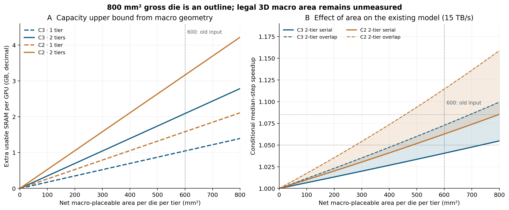

# 3D SRAM 면적 예산: 600 mm² 가정 재검토

2026-09-21. `SRAM_HIERARCHY_MODEL.md`의 용량·속도 표를 **면적 확정값으로 인용하기 전에** 필요한 계산이다. [재현 코드](scripts/area_budget_3dsram.py), [수치 JSON](assets/sweep/area_budget_3dsram.json), [CSV](assets/sweep/area_budget_3dsram.csv), [그림](assets/figures/sram-area-budget.png).



## 판정

**600 mm²는 물리적으로 검증된 배치 면적이 아니다.** 과거 사용자가 넣었던 민감도 입력이었다. **800 mm²도 매크로가 전부 들어가는 면적이 아니라 다이 외곽의 계획값**이다. 현재 새 계층 문서의 C2 2층 **4.22 GB**는 매 다이의 두 메모리 층에 각각 **800 mm² 전부**를 매크로 배치 면적으로 주었을 때의 면적 산술 상한이다. 따라서 이를 “만들 수 있는 최대 설계점”으로 확정하거나 **1.085×**를 대표 성능으로 인용할 수 없다. NVIDIA는 Blackwell GPU가 두 reticle 크기 다이로 구성된다고 밝히고, 각 다이에 독립 L2와 DRAM controller가 있다고 설명하지만 메모리 층의 **실제 적법 배치 영역**은 공개하지 않는다. [NVIDIA Blackwell 구조](https://www.nvidia.com/en-us/data-center/technologies/blackwell-architecture/), [NVIDIA locality-domain 설명](https://developer.nvidia.com/blog/accelerating-data-processing-with-nvidia-multi-instance-gpu-and-numa-node-localization/)

## 1. 면적을 닫는 식

다이 `d`, 메모리 층 `i`마다 다음을 따로 결정한다.

```text
Mᵢ,d = memory-tier outline ∩ legal-overlay regions − union(edge/seal,
       interface/clock/PDN constraints, thermal exclusion, controller/global routes,
       macro halo and other keep-outs)

Nᵢ,d = pack(Mᵢ,d, macro rectangle, orientation and spacing rules)

Cusable = Σᵢ,d Nᵢ,d × (macro bits/8) × 0.88 × 0.95
```

`Mᵢ,d`는 **면적의 숫자 하나가 아니라 배치 가능 폴리곤**이다. 제외 영역끼리 겹칠 수 있으므로 각 면적을 기계적으로 더해 빼면 안 된다. `pack`은 남은 영역에 실제 매크로를 놓는 단계다. `floor(A_net/A_macro)`는 모양을 모를 때의 **낙관적 상한**이다. 2층이라고 `M₁=M₂`도 아직 모른다. HBM PHY·NV-HBI 위를 반드시 비워야 한다고 가정한 것은 아니며, 해당 위치의 적층·배선·열 제약을 실제 floorplan에서 판정해야 한다.

민호님 정정의 상부 BEOL 매크로는 C3 **183×656 µm = 0.120048 mm²**, C2 **153×518 µm = 0.079254 mm²**다. 현재 보고 용량을 재현하기 위해 **1 macro=10⁶ bit**, usable `0.88×0.95=0.836`을 사용했다. 각 매크로의 로컬 페리와 ECC/리던던시를 이미 계산했으므로 다시 공제하지 않는다. 다만 글로벌 컨트롤러·PDN·배선, macro halo, 영역 단편화는 아직 산출되지 않았다. **1 Mb와 1 Mib 정의가 미해결**이며 후자면 용량이 4.8576% 늘어난다. C2의 무보상 BEOL 페리와 2D sense amplifier의 실현성도 확인 전이다.

## 2. 면적별 조건부 용량

다이 2개, 두 메모리 층에 **같은 순배치 면적**을 준 면적 산술 상한이다. GB는 십진 단위다. 아래 면적 500·600·700은 **시나리오**이지 측정 기반 신뢰구간이 아니다.

| 매 다이·매 층 순배치 면적 | 800 대비 미배치 | C3 1층 | C3 2층 | C2 1층 | C2 2층 |
|---:|---:|---:|---:|---:|---:|
| 500 mm² | 300 mm² | 0.870 GB | 1.741 GB | 1.318 GB | 2.637 GB |
| 600 mm² | 200 mm² | 1.045 GB | 2.089 GB | 1.582 GB | 3.164 GB |
| 700 mm² | 100 mm² | 1.219 GB | 2.437 GB | 1.846 GB | 3.692 GB |
| 800 mm² | 0 mm² | 1.393 GB | 2.786 GB | 2.110 GB | **4.219 GB** |

600 mm²는 800의 75%를 배치한다고 말하는 것과 같다. 정사각형 800 mm² 다이에서 주변부만 띠로 제외한다고 **가정해 환산**하면 약 **1.895 mm** 폭이다. 실제 다이 모양이나 제외 구역이 그렇다는 뜻은 아니다. 같은 정사각형에서 1 mm 둘레 띠만 가정하면 남는 면적은 **691 mm²**다. 실제 직사각형 매크로를 단일 정사각형 영역에 격자로 배치하는 단순 검사에서는 면적만 나눈 값보다 약 1~2% 더 적게 들어간다. 배치 영역이 여러 조각으로 나뉘고 글로벌 선로·PDN이 지나면 손실이 커질 수 있다.

## 3. 현재 계층 모델의 성능 숫자에 미치는 영향

기존 `scripts/hierarchy_model.py`의 Llama-3.1-8B B=8, 초기 context 2048, **15 TB/s 가정**, 고정 보유, 2층, 회귀 median-step 모델을 그대로 두고 면적만 바꿨다. 속도는 **3D 적용 실측이나 TPOT p99가 아니다.** 직렬·겹침은 내부 모델의 두 시나리오다.

| 순배치 면적/층/다이 | C3 2층 용량 | C3 직렬–겹침 | C2 2층 용량 | C2 직렬–겹침 |
|---:|---:|---:|---:|---:|
| 500 mm² | 1.741 GB | 1.034–1.060× | 2.637 GB | 1.052–1.094× |
| **600 mm²** | **2.089 GB** | **1.041–1.073×** | **3.164 GB** | **1.063–1.115×** |
| 700 mm² | 2.437 GB | 1.048–1.086× | 3.692 GB | 1.074–1.136× |
| 800 mm² | 2.786 GB | 1.055–1.100× | 4.219 GB | **1.085–1.159×** |

같은 모델에서 **1.05×**를 얻으려면 2층일 때 필요한 매크로 면적 하한은 C2 **484.48 mm²/층/다이**, C3 **733.85 mm²/층/다이**(직렬 계산)다. **1.085×**에는 C2 **796.98 mm²**, C3는 800 mm² 안에서 불가능하다. 완전 겹침에서는 각각의 면적 경계가 더 낮아지지만, 실제 경로 겹침 비율은 미측정이다. 이 값들은 소자 목표가 아니라 **현 회귀 모델 내부의 문턱값**이다.

## 4. 면적을 실제로 확정하려면

소자팀·물리설계팀으로부터 최소한 아래 정보를 받아 `Mᵢ,d`를 만들고 매크로 격자를 실제로 놓아야 한다.

1. 다이·각 메모리 층의 **가로×세로 외곽 치수**와 배치 가능 폴리곤 또는 GDS/DEF 추출 마스크. 공개 아키텍처 그림은 면적 지도가 아니다.
2. 층별 edge/seal, 글로벌 선로·전력망, thermal keep-out, controller/clock 영역, 매크로 간격과 방향 제한. 무엇이 겹쳐도 되는지도 표시.
3. 1층·2층 각각의 독립 배치 및 MIV 관통·배선 제약. 두 층의 면적을 단순히 두 배로 쓸 수 있는지 검증.
4. BEOL 페리 C2/C3의 실제 구현 가능성, `1 Mb`의 bit 정의, usable 83.6%의 정확한 적용 범위.
5. 면적이 정해진 뒤 해당 매크로 수에서 **전력·열·compute-delivered BW** 재산출. 매크로 수가 선형으로 늘어도 15 TB/s가 유지되거나 늘어난다고 가정하지 않는다.

**대역폭에 대한 보완 (2026-09-21, Claude).** 3절 표는 15 TB/s 고정 cap이다. `canonical_constants.json`은 읽기 전달 cap을 **{15, 17.7, 19} 세 시나리오**로 둔다. 어느 면적에서도 어레이 raw(400 mm²에서도 452 TB/s 이상)가 모든 cap을 20배 넘게 초과하므로 **용량만 면적에 비례하고 전달 대역폭은 면적과 무관하다**. cap 3종 × 면적 4종 표는 `assets/sweep/sync_tables.csv`에 있다. 600 mm² C2 2층의 고정 배치는 cap 15에서 1.063~1.115, cap 19에서 1.073~1.115다.

그 전까지 본문에는 **“C2 2층 4.22 GB·1.085× 가능”** 대신 **“800 mm² 전면 배치를 가정한 기하학적 상한. 층별 순배치 영역 확정 전의 결과”**라고 써야 한다. `600 mm²`도 면적 근거가 생기기 전에는 민감도 행으로 남긴다.

## 5. 논문 흐름에서 별도로 고칠 부분

붙여준 검토 의견의 **27.7 TB/s 직렬 조건과 혼합 대역폭 조건의 충돌**, **r=0.6에서 3.8 TB/s와 전력 예시 5 TB/s 혼합**, **단조성 가정**, **6.4 TB/s를 물리 HBM 링크로 취급하는 표현**, **실제 L2 miss counter 필요성**에는 동의한다. 면적을 고쳐도 이 문제들은 남는다.

한 단계 더 주의할 점은 **6.40 TB/s 자체의 식별성**이다. 현재 Llama 회귀는 네 개의 `(batch, context)` 앵커에서 **논리 트래픽과 step median의 동반 변화**를 맞춘 2파라미터 식이며 최대 잔차가 2.08%다. 이것만으로 “같은 workload에서 HBM 제공 byte만 줄였을 때 지연이 정확히 `Δbyte/6.40`만큼 줄어든다”는 인과적 교체 효과가 확인되지는 않는다. 15 TB/s 문턱과 speedup 표도 이 교체 가정에 매여 있다. L2 hit/miss와 HBM read/write 직접 카운터, 동일 workload의 보유량 조절 실험, 실제 경로 혼잡·겹침 측정으로 검증해야 한다. 또한 M0→M1은 고정항과 유한한 티어 BW를 동시에 더하므로 “그 차이가 모두 고정항 때문”이라고 표현할 수 없다. 800 mm² C2 2층 예에서 **M0 1.301× → 고정항만 반영 1.159× → 15 TB/s 직렬 비용까지 반영 1.085×**로 분리된다.

보존 exact replay 입력(`assets/experiments/3dsram_closure_20260921/inputs/llama-b8-l2048-events.jsonl`)은 블록 weight만 세어 weight read가 **13.959 GB/step**, 전체 read+write가 **16.108 GB/step**이다. LM head 1.051 GB/step이 빠진 구형 장부다. 공동 정본은 임베딩을 제외하고 LM head를 포함한 weight read **15.010 GB/step**이며, hierarchy 모델은 이 정의를 사용한다(`assets/sweep/canonical_constants.json`). 따라서 exact replay의 HBM 절감률은 보존 trace 결과로만 인용하고, 최종 논문 그래프 전에는 정본 15.010으로 event ledger를 재생성한다. 면적·매크로 수 산술에는 영향이 없다.
