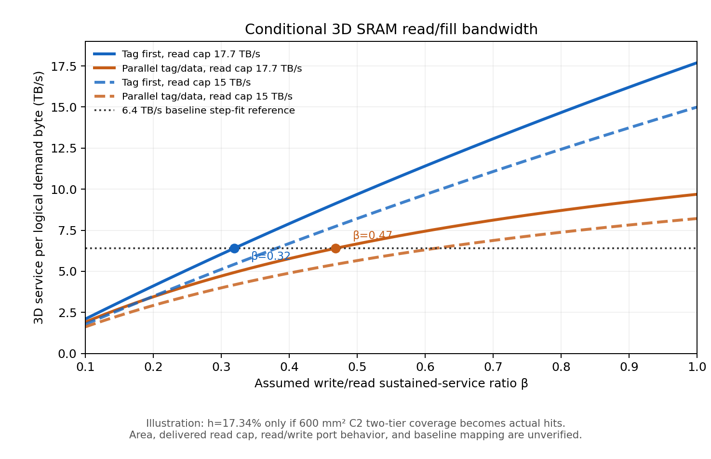

# L2와 3D SRAM 대역폭 입력 계약

작성: 2026-09-21. 이 문서는 대역폭의 **출처**, **수치의 뜻**, **모르는 값**을 분리한다. 여기의 캐시 계산은 설계 민감도 분석이며, 실측 p99 또는 검증된 캐시 성능이 아니다.

## 1. 출처별로 쓸 수 있는 숫자

| 입력 | 값 | 정확한 뜻 | 모델에서의 사용 |
|---|---:|---|---|
| B200 HBM | 최대 8 TB/s | 제품 사양의 HBM 대역폭 | 물리 링크의 공칭 상한. 실제 decode 처리율로 대체하지 않음 |
| B200 L2 | 16.8–21 TB/s | Chips and Cheese의 Vulkan 기반 **읽기** 마이크로벤치. 파티션 교차/내부 조건 | L2 읽기 경로의 참고 범위. 우리 decode의 지속 전달 대역폭, L2 fill 쓰기 속도, 3D 접속 링크 속도를 뜻하지 않음 |
| decode 회귀 | 약 6.40 TB/s | `step_ms = t0 + logical_bytes / B_fit`의 기울기. 하드웨어 카운터가 아님 | 기존 workload의 체감 기준선. 물리 HBM→L2 대역폭이라고 부르지 않음 |
| 3D 매크로 합 | 59.7 TB/s | 민호님 v2.0 덱의 320 mm², 2,664개 매크로가 동시에 동작할 때의 어레이 피크 | 물리적 상한. SM 전달량으로 사용하지 않음 |
| 3D 보정 추정 | 17.7 TB/s | 덱의 **320 mm², 2,664 매크로 설계점**에서 `59.7 / (12.8 / 3.8)`; H100 L2와의 경험적 비교 | 그 설계점의 **읽기 지향 투영치**. 600 mm², C2, 복수 다이/층의 delivered BW로 그대로 옮길 근거가 없음 |
| 3D 혼합 슬랙 표 | r=1/.8/.6에서 15/9.4/3.8 TB/s | 민호님 2026-09-20 슬랙 Q4. 원본 덱에는 없는 후속 설명이며 `η_bank(r)`의 함수와 raw 데이터가 없음 | 별도 비공식 시나리오와 교차 점검용. 덱 수치나 확정 device fact로 승격하지 않음 |

출처: 사용자 제공 `3DSRAM_n5a.zip`의 `2DM3DSRAM_n5a_tf_v2.0_0919.md`, 사용자 제공 민호님 슬랙 Q4, [NVIDIA HGX B200 사양](https://docs.nvidia.com/enterprise-reference-architectures/hgx-ai-factory-h100-h200-b200/latest/components.html), [Chips and Cheese B200 측정](https://chipsandcheese.com/p/nvidias-b200-keeping-the-cuda-juggernaut), 현 저장소의 decode 회귀. L2 마이크로벤치 수치의 측정 방법과 3D 투영치의 calibration 대상이 달라서 같은 링크의 보증 상한으로 묶을 수 없다.

**면적을 바꾸면 대역폭 입력도 다시 정의해야 한다.** 덱의 59.7/17.7은 320 mm², 2,664 매크로에 묶인 수치다. 임시 600 mm² C2 계산은 7,570 매크로/다이/층이므로 단일 다이·단일 층의 단순 어레이 합만 해도 `7,570 × 22.4 GB/s = 169.6 TB/s`가 된다. 층과 다이를 더해도 **SM 전달량이 그 배수로 증가한다는 뜻은 아니다**. bank 컨트롤러, 수직 접속, 3D→SM 링크, 열·전력, 공통 경로의 상한이 먼저 필요하다. 아래 15/17.7 예시는 **고정 전달 cap 시나리오**이지 600 mm² 설계점의 소자팀 예측값이 아니다. 600 mm² 자체도 아직 순가용 배치 면적으로 검증되지 않았다.

## 2. 같은 바이트 기준으로 혼합 대역폭 정의

`D` = L2를 통과해 3D/HBM 경로에 들어오는 한 단계의 **논리적 요구 바이트**. `h` = 이 스트림에 대해 실제로 검증한 3D 증분 적중률. `f` = 미스 바이트 중 3D에 채우는 비율. `B_R` = 3D 읽기 지향 지속 서비스율의 가정, `B_W = β_W B_R` = 쓰기 서비스율의 가정.

| data-array 접근 방식 | 읽기 바이트 `R` | 쓰기 바이트 `W` | 직렬 공유 포트일 때 논리 바이트당 3D 시간 `T_3/D` |
|---|---:|---:|---:|
| tag-first, hit 때만 읽기 | `hD` | `f(1-h)D` | `h/B_R + f(1-h)/B_W` |
| tag/data 병렬, 미스도 data-array 읽기 | `D` | `f(1-h)D` | `1/B_R + f(1-h)/B_W` |

`B_3,logical = D/T_3`. **병렬 읽기의 총 어레이 작업 바이트는 `(2-h)D`이므로 `read_fraction = 1/(2-h)`를 위 식의 `h` 자리에 대입하면 단위가 틀린다.** 독립 1R1W 포트라면 `T_3 = max(R/B_R, W/B_W)`가 첫 근사다. read/write 전환 지연, bank 충돌, 메모리 컨트롤러, 3D→SM 경로, 전력·열 상한은 별도의 항 또는 cap으로 둔다. 미스 데이터를 fill buffer에서 SM으로 바로 전달하면 fill 쓰기와 SM 전달의 지연 경로도 분리해야 한다.

## 3. 현재 숫자로 본 역산: 설명용 조건, 성능 예측 아님

600 mm²/다이/층, C2, 2층의 용량은 기존 면적 산술상 GPU당 3.164 GB이다. 기존 workload working set 18.247 GB로 나눈 **커버리지**는 17.34%다. 아래에서 `h=0.1734`로 둔 것은 이 커버리지가 실제 증분 적중률로 달성된다는 **가정**이다. 기존 ledger의 단순 streaming LRU에서는 적중률이 0에 가깝게 모델링되어 있으므로, 무관리 demand cache에 이 `h`를 자동 적용하면 안 된다. 아래의 15/17.7은 위에서 정의한 고정 전달 cap 시나리오다.

`f=1`, 포트 직렬 공유, 비교선 `B_fit=6.40 TB/s`일 때 `B_3,logical ≥ B_fit`가 되는 **최소** 쓰기/읽기 비율은 아래와 같다. 이 비교는 기존 회귀값을 surrogate 기준선으로 쓰는 것이며 새로운 하드웨어의 speedup 또는 p99 개선을 보증하지 않는다.

| 가정한 `B_R` | tag-first 필요 `β_W` | tag/data 병렬 필요 `β_W` |
|---:|---:|---:|
| 17.7 TB/s (320 mm² 덱 추정치를 그대로 cap으로 둔 가정) | 0.319 | 0.468 |
| 15.0 TB/s (슬랙의 r=1 수치를 그대로 cap으로 둔 가정) | 0.381 | 0.615 |

17.7 기준, `β_W=0.25/0.50/1.00`이면 tag-first의 `B_3,logical`은 각각 **5.09/9.69/17.7 TB/s**, tag/data 병렬은 **4.11/6.67/9.69 TB/s**다. 따라서 같은 `β_W=0.5`도 미스 시 불필요한 data-array read의 여부에 따라 경계선을 넘거나 간신히 넘는다.

`B_3,logical > B_fit`은 **기존보다 느리지 않기 위한 단순 겹침 모델의 문턱**이다. HBM 절감량 `hD`가 만드는 최대 이득에 거의 도달하려면 3D가 `D/B_3,logical ≤ (1-h)D/B_fit`까지 빨라야 하므로 문턱은 `B_fit/(1-h)=7.74 TB/s`다. 두 문턱 모두 측정된 HBM 바이트 또는 p99 결과가 아니며, 실제 L2·3D 경로가 겹친다는 구조 가정을 필요로 한다.

## 4. 슬랙 Q4 표와 단순 `β_W` 모델의 일치 여부

슬랙의 read-only 기준 `B_R=15`와 직렬 공유 포트 식 `B_mix = B_R/[r+(1-r)/β_W]`를 **총 어레이 작업 바이트당** 대역폭으로 해석하면:

| 슬랙 점 | 이를 재현하는 `β_W` |
|---|---:|
| r=0.8, 9.4 TB/s | 0.251 |
| r=0.6, 3.8 TB/s | 0.119 |

따라서 **상수 `β_W` 하나로 두 점을 동시에 재현하지 못한다.** bank 충돌, 전환 비용, 스케줄링, 대역폭 분모 또는 다른 비선형 효과가 들어갔을 수 있다. 슬랙 표는 버릴 수 없는 후속 출처지만 `r<0.6`으로 평탄하게 연장할 근거도 없다. `r=0.6`의 3.8과 덱의 H100 L2 측정 3.8은 숫자가 같지만, 같은 의미라는 증거는 없다.

## 5. 모델 입력 결정

1. **L2:** 16.8–21 TB/s를 읽기 마이크로벤치 범위로 표기한다. 원래 baseline은 실측 step 시간으로 보정하며, L2 mixed read/write BW, L2→3D 및 3D→SM 물리 링크는 `unknown`으로 둔다. L2와 3D의 속도를 합하거나 `min(19, 17.7)`로 일괄 제한하려면 실제 경로 연결과 동시 실행 조건부터 정의해야 한다.
2. **3D 읽기:** 17.7 TB/s는 덱 기반 projection, 15 TB/s는 후속 슬랙 시나리오로 분리한다. 둘 다 실측 sustained 값으로 부르지 않는다. 59.7 TB/s는 peak 천장만 표기한다.
3. **3D 쓰기·충전:** 단일 숫자를 고정하지 않는다. `β_W`, tag/data 접근 방식, fill 비율, 1RW/1R1W 포트, read/write 전환 비용, bank 스케줄링, 3D→SM 링크 및 전력 cap을 축으로 sweep한다. 이 입력이 오기 전에는 demand cache의 유불리를 확정하지 않는다.
4. **논문 성능:** hit rate는 용량/working set이 아니라 ledger replay의 실제 L2 미스 후 적중 바이트로 산출한다. p99 TPOT/step은 baseline 실측 또는 재현 가능한 trace replay로 검증한다. `B_fit=6.40`과 위 역산표로 p99 개선치를 만들어내지 않는다.

**교차 확인 (2026-09-21, Claude).** §2의 단위 경고(병렬 읽기에서 `r = 1/(2-h)`를 공유 포트 식의 `h` 자리에 넣으면 안 됨)는 `SRAM_HIERARCHY_MODEL.md` 3-3절에 반영했다. §3의 β 문턱과 그쪽 문턱은 **같은 식의 다른 행**이다. 이 문서는 h = 0.1734(600 mm²)에 cap 17.7과 15, 저쪽은 h = 0.231(800 mm²)에 cap 19다. 절대 쓰기 대역폭으로 환산하면 어느 행이든 본전이 **5.3 ~ 5.7 TB/s**로 거의 같다. 본전 조건이 `B_mix ≥ 6.40`이라 cap과 h에 약하게만 의존하기 때문이다. 통합 표는 `assets/sweep/sync_tables.csv`.

또한 §4의 "상수 β 하나로 슬랙 두 점을 재현하지 못한다"는 관찰이 맞다. 0.251과 0.119로 갈린다. 저쪽 문서는 이를 "슬랙 표가 함의하는 β 범위 0.12 ~ 0.25"로 인용하며, 단일 β 모델이 아니라 **범위**로만 쓴다.

민호님께서 우선 답해야 할 핵심은 **17.7의 정확한 트래픽 정의**, **1RW/1R1W와 bank 간 read/write 동시성**, **쓰기 주기/지속 BW**, **read↔write 전환 비용**, **Q4의 9.4/3.8 산식과 분모**, **3D 출력 경로 및 열 cap**이다.
