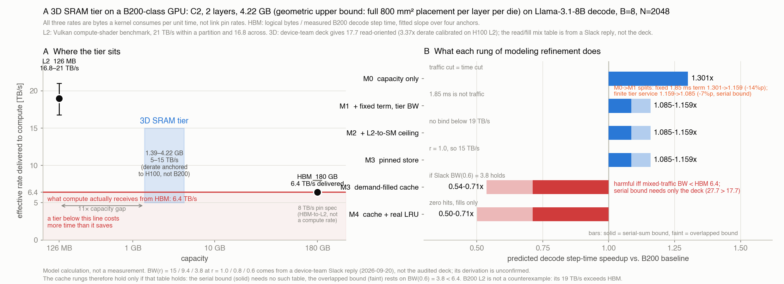
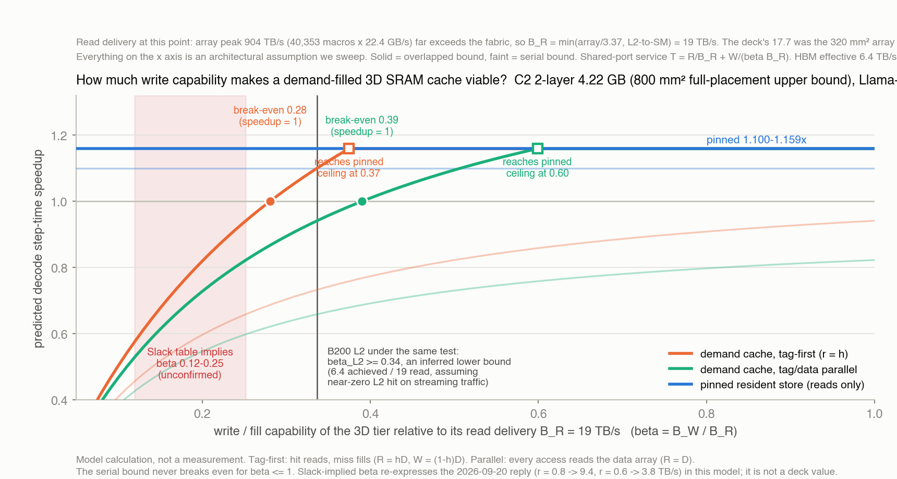

# 3D SRAM 계층 모델과 추상화 사다리 — 논문 A의 구조 문서

작성 2026-09-20, 갱신 2026-09-21. 이 문서가 논문 A의 모델 구조 기준이다. **숫자의 정본은 `assets/sweep/canonical_constants.json`이고, 에이전트 간 동기화는 `WORKLOG_3DSRAM.md`에서 한다.** 면적은 `3DSRAM_AREA_BUDGET.md`, 대역폭 입력 계약은 `3DSRAM_BANDWIDTH_ASSUMPTIONS.md`(Codex)를 따른다. `SRAM_SWEEP_REPORT.md`는 구판 작업 로그다.

> **2026-09-21 정정 요약.** (1) 이 문서의 4.22 GB는 800 mm² 전면 배치의 **기하 상한**이며 600 mm² 시나리오면 3.164 GB다. (2) 읽기 전달 cap은 19 하나가 아니라 **{15, 17.7, 19} 세 시나리오**로 병행한다. GB급에서 어레이 raw가 cap을 30배 이상 넘어 전달 BW는 면적과 무관하다. (3) Llama weight 읽기의 정본은 15.010 GB(임베딩 제외, LM head 포함)이며 15.1과의 차이는 speedup 0.03%p 이내다. (4) 6.40 TB/s는 (B, N) 앵커 간 기울기이고, 같은 workload에서 HBM 바이트만 줄였을 때의 인과적 한계율은 미검증이다. 기존 B200 마이크로벤치는 지연 지배(달성 0.8 TB/s)라 이를 답하지 못한다.

재현: `python3 scripts/hierarchy_model.py` → `assets/sweep/hierarchy_ladder.csv`, `python3 scripts/make_hierarchy_figure.py` → `assets/figures/sram-hierarchy-ladder.{svg,pdf,png}`.



## 0. 이 문서가 답하려는 질문

논문이 주장해야 하는 것은 "3D SRAM을 넣으면 몇 % 빨라진다"가 아니라 **이 질문을 답하려면 모델을 어디까지 정교하게 세워야 하며, 그렇게 세운 모델이 실측을 얼마나 반영하는가**이다. 그래서 구조를 먼저 고정하고, 추상화 단계를 하나씩 올리면서 각 단계가 답을 얼마나 바꾸는지를 보인 뒤, 마지막에 프레임워크를 주장한다.

## 1. 구조 — 세 개의 링크

이전까지 쓰던 "fabric 20 TB/s" 하나를 버리고 세 링크를 분리한다. 각각 출처가 다르고 등급이 다르다.

```
   SM (compute)
    ▲        ▲
    │ L2→SM  │ 3D→SM (우회 시)
    │        │
   L2 ◄──── 3D SRAM
    ▲
    │ HBM→L2
   HBM
```

| 링크 | 값 | 출처 | 등급 |
|---|---:|---|---|
| HBM → L2 (peak) | 8.0 TB/s | NVIDIA B200 사양 | 공식 |
| HBM → L2 (effective) | **6.40 TB/s** | 실측 decode 앵커 8개에 대한 2파라미터 회귀 | **측정 유도** |
| L2 → SM | 16.8 ~ 21 TB/s | Chips and Cheese B200 마이크로벤치. 21은 파티션 내부, 16.8은 파티션 교차 | 3자 측정 |
| 3D SRAM → SM (덱) | 59.7 피크 / **17.7** like-for-like | 소자팀 v2.0 덱(2026-09-19). 17.7 = 59.7 / 3.37, 3.37 = 모델의 H100 L2 예측 12.8 ÷ 실측 3.8. **디레이트 앵커가 H100 L2다** | 모델(감사 반영 덱) |
| 3D SRAM → SM (슬랙) | 15 / 9.4 / 3.8 TB/s at r = 1.0 / 0.8 / 0.6 | 박민호 슬랙 회신 2026-09-20 01:30 Q4. 15 = 17.7 × η_sched 0.85. η_bank(r, N_bank=16) 함수형은 미제시. **덱에는 없다** | 모델(비공식, 유도 미확인) |
| 열 상한 | 5 TB/s (0.5 pJ/bit, 20 W) | 같은 슬랙 Q3. P/E 산술이며 E/bit는 소자팀 스스로 미측정이라 명시 | 가정 |
| L2 용량 | 126 MB | NVIDIA Blackwell 튜닝 가이드 | 공식 |
| 3D 티어 용량 | 1.39 ~ 4.22 GB | 소자팀 사용가능 밀도 × 800 mm² 다이 × 2다이 | 모델 |

**세 값이 같은 단위인가 — 먼저 확인할 것.** 대역폭은 경로마다 다르다. HBM ↔ L2 링크 속도와 SM이 실제로 데이터를 받는 속도는 다른 양이다. 세 값이 무엇을 재는지 확인했다.

| 값 | 무엇을 나눈 것인가 | 종류 |
|---|---|---|
| HBM 6.40 TB/s | 구조식 **논리 바이트** ÷ **실측 step 시간**, 4개 앵커에 대한 기울기 | 커널 체감 |
| L2 16.8 ~ 21 | Vulkan 컴퓨트 셰이더가 소비한 바이트 ÷ 시간 | 커널 체감 |
| 3D 5 ~ 15 | 어레이 피크 59.7 ÷ 디레이트 3.37 | 모델, 앵커는 커널 체감 |

**6.40은 Nsight의 `dram__bytes / time`이 아니다.** 우리는 하드웨어 카운터를 수집한 적이 없다(`memory.html`에 "카운터 접근 불가"로 명시). 대신 step_ms = t0 + 논리트래픽/B_eff 를 모델별 4점에 맞춘 기울기다. 즉 **논리 바이트가 늘 때 step 시간이 늘어나는 한계 비율**이며, 메모리 컨트롤러·L2 경로·패브릭·stall을 통째로 포함한 커널 체감 서비스 속도다. Llama 잔차 최대 2.1%, Llama-2 0.7%.

편향 둘을 적어 둔다.

1. **분자가 논리 바이트다.** L2 재사용이 있으면 실제 DRAM 바이트는 더 적으므로 진짜 HBM ↔ L2 링크 속도는 6.40보다 낮다. L2 적중률 10%면 5.8, 20%면 5.1이다. 우리 6.40은 **논리 바이트가 compute에 도달하는 속도**이고, 이것이 우리 용도에는 정확히 맞는 양이다. 티어를 붙이면 논리 바이트가 경로 전체에서 빠지기 때문이다.
2. **한계 기울기이지 평균이 아니다.** 고정항 t0 안에 숨은 메모리 시간은 분리되지 않는다.

**따라서 y축은 "링크 대역폭"이 아니라 "compute가 받는 유효 속도"다.** HBM 공칭 8 TB/s는 핀 속도이자 HBM ↔ L2 값이므로 이 축에 찍으면 안 된다. 그림에서는 참고선으로만 남겼다.

**남은 문제 — 소자팀 디레이트의 앵커가 H100이다.** 소자팀은 자기 모델이 H100 L2를 12.8 TB/s로 예측하는데 실측이 3.8이므로 3.37배 과대추정한다고 보고, 같은 디레이트를 어레이 피크 59.7에 걸어 17.7을 얻었다. 그런데 **같은 종류 벤치에서 B200 L2는 16.8 ~ 21 TB/s로 H100의 4.4 ~ 5.5배다.** 3.37은 어레이의 성질이 아니라 **H100 크로스바가 받아주지 못한 정도**이고, B200급 패브릭에 붙일 때 그대로 쓸 근거가 없다. 17.7이 B200 L2 실측 범위와 겹치는 것은 유도가 아니라 우연이므로 상호 검증으로 쓰면 안 된다.

**HBM 값의 모호성이 결론을 바꾸는가 — 아니다.** 논리 바이트 기준 6.40 대신 L2 적중을 가정해 4.5 ~ 6.4 범위로 흔들어도 이렇다.

| 가정 HBM | 티어가 넘어야 할 선 | 캐시 본전 필요 BW | 상한 15 대비 | 고정 배치 speedup |
|---:|---:|---:|---:|---:|
| 6.40 | 6.40 | 27.7 TB/s | 1.8배 | 1.085 |
| 5.76 | 5.76 | 24.9 | 1.7배 | 1.097 |
| 5.12 | 5.12 | 22.1 | 1.5배 | 1.109 |
| 4.48 | 4.48 | 19.4 | 1.3배 | — |

캐시 판정은 전 구간에서 불변이다. 고정 배치 speedup은 오히려 조금 올라간다. 유일하게 움직이는 것은 "티어가 넘어야 할 선"이 5 ~ 6.4 사이라는 점이고, 소자팀 열 상한 5 TB/s는 어느 쪽이든 경계선이다.

**3D 티어가 넘어야 하는 선은 8이 아니라 5 ~ 6.4다.** 공칭 핀 속도가 아니라 compute가 실제로 받는 속도와 겨룬다.

**계층으로서 말이 되는가.** 용량은 126 MB와 180 GB 사이에 1.4 ~ 4.2 GB로 들어가고, 속도는 HBM 6.4와 L2 19 사이에 9.4 ~ 15로 들어간다. **읽기 전용 15 TB/s라면 L2의 79%, HBM의 2.3배**다. 중간 계층으로 성립한다. 열 상한 5 TB/s로 떨어지면 HBM과 비슷하거나 느려져 계층이 깨진다.

## 2. 추상화 사다리 — 각 단계가 답을 얼마나 바꾸는가

기준점: 만들 수 있는 가장 큰 설계점 C2 2층 4.22 GB, Llama-3.1-8B decode, 배치 8, 문맥 2,048. working set 18.2 GB, 스텝 트래픽 17.2 GB, 커버리지 23.1%, 기준 step 4.549 ms.

티어 시간을 어떻게 더하느냐에 따라 두 경계가 있다. **직렬 합**은 티어 서비스 시간이 HBM 시간에 더해진다고 보고(비관), **겹침**은 티어 시간이 HBM 시간 아래 숨는다고 본다(낙관). B200 L2 같은 잘 만든 캐시는 겹침 쪽에 있다. 충전을 전달과 겹치고 대역폭이 HBM보다 커서 병목이 되지 않기 때문이다. 그래서 각 단계를 두 경계의 범위로 적는다.

| 단계 | 추가한 물리 | 직렬 합 | 겹침 |
|---|---|---:|---:|
| M0 | 용량만. 트래픽 감소가 곧 시간 감소 | 1.301배 | 1.301배 |
| M1 | + 고정항 t0, 티어 대역폭 15 | **1.085배** | **1.159배** |
| M2 | + L2→SM 상한 19 | 1.085 | 1.159 (19가 물지 않음) |
| M3a | 고정 배치 저장소. r = 1.0 → 15 TB/s | 1.085 | 1.159 |
| M3b | 수요 충전 캐시. r = 적중률 0.231 → BW ≤ 3.8 | **0.537배** | **0.712배** |
| M4 | 캐시 + 실제 LRU. 적중 0, 충전만 | 0.501 | 0.712 (충전을 숨기면 1.000) |

**단일 최대 보정은 M0 → M1이다.** 고정항 1.85 ms는 트래픽이 아니라 compute와 지연과 커널 실행이고, 티어가 줄일 수 없다. 용량만 보는 추상화는 답을 1.3배로 부풀린다. 실제로는 1.085 ~ 1.159배다.

**두 번째는 M3에서 갈라지는 분기다.** 고정 배치는 두 경계 모두에서 이득이고, 수요 충전 캐시는 두 경계 모두에서 손해다. 왜 그런지는 3절이 답한다.

이 분기는 원래 구조식에서 나온 **예측**이었다. 2026-09-21에 정확 재생으로 확인됐고, 그 과정에서 사다리 마지막 단이 서는 축이 바뀌었다. 2-B절이다.

## 2-B. 충전 규율 — 정확 재생이 β 모델을 확인한다 (2026-09-21)

`assets/experiments/3dsram_closure_20260921`의 정확 재생은 처음에 위 표와 **반대로** 보였다. scan-resistant insertion(LIP)이 HBM 논리 바이트를 18% 줄였기 때문이다. 원인은 **그 재생이 충전(fill) 측을 세지 않은 것**이었다. 충전을 세면 재생이 구조식과 같은 답을 낸다. 구조식이 틀렸던 것이 아니라 두 장부가 다른 것을 세고 있었다.

재현: `python3 scripts/gate3b_fill_discipline.py`. 아래는 전부 **정상 상태(마지막 스텝)** 기준이다. closure CSV의 값은 32스텝 평균이라 콜드 충전을 포함한다(LIP 충전은 정상 상태 13.862 / 평균 13.965 GB, HBM 감소는 18.59 / 18.00%). **두 통계를 섞지 않는다.** 정상 상태가 긴 생성의 decode를 말하는 올바른 통계이고, 32스텝 평균은 짧은 요청 민감도다.

**바이트 흐름, C2 2층 600 mm² (티어 3.164 GB, 기존 L2 포함 3.297 GB)** [trace replay]

| 구성 | HBM 감소 | 티어 읽기 | 충전 | 충전 / D |
|---|---:|---:|---:|---:|
| integrated LRU | −0.77% | 0.000 GB | 17.157 GB | 99.99% |
| integrated LIP | +18.59% | 3.296 | **13.862** | **80.79%** |
| integrated LIP + bypass | +18.59% | 3.297 | **0** | **0%** |
| 관리 상주 | +18.59% | 3.297 | 0 | 0% |

수요 충전 티어는 정상 상태에서 **미스 바이트 = 충전 바이트**다. 31스텝 내내 감쇠가 0이다. 적중률이 정확히 0인 LRU는 스텝 트래픽 전체를 티어에 쓰고 아무것도 돌려받지 못한다.

**요구 쓰기 대역폭 — 마지막 단이 사는 축** [projection]

speedup ≥ 1이 되는 **최소 절대 B_W**다. "없음"은 쓸 것이 없어 제약 자체가 없다는 뜻이다.

| 구성 | 직렬 B_R=19 | 겹침 B_R=19 | 직렬 B_R=15 | 겹침 B_R=15 |
|---|---:|---:|---:|---:|
| integrated LRU | 불가능 | 6.45 | 불가능 | 6.45 |
| integrated LIP | **43.18** | 5.57 | **50.45** | 5.68 |
| integrated LIP + bypass | **없음** | 없음 | 없음 | 없음 |
| 관리 상주 | **없음** | 없음 | 없음 | 없음 |

**speedup** (기준 step 4.5125 ms = t0 1.852 + 17.027 / 6.40)

| 구성 | 직렬 19/19 | 직렬 19/5 | 겹침 19/19 | 겹침 19/5 |
|---|---:|---:|---:|---:|
| integrated LRU | 0.830 | 0.567 | 0.995 | 0.854 |
| integrated LIP | 0.917 | 0.648 | 1.123 | 0.941 |
| integrated LIP + bypass | **1.077** | **1.077** | **1.123** | **1.123** |
| 관리 상주 | 1.077 | 1.077 | 1.123 | 1.123 |

**읽는 법 세 가지.**

1. **LIP는 β = 1에서도, 즉 쓰기가 읽기만큼 빠르더라도 직렬 경계에서 진다(0.917).** 본전에 필요한 43 TB/s는 덱 17.7에도 패브릭 19에도 근처가 아니다. 3절의 "수요 충전은 혼합 트래픽 대역폭이 HBM 아래면 불가능하다"가 정확 재생에서 재현됐다.
2. **bypass와 관리 상주는 바이트 단위로 같다.** 주기 트레이스에서 "한 번 채우고 얼리기"와 "고정 배치"는 같은 것이기 때문이다. LIP의 상주 집합도 트레이스 선두 prefix와 3150개 중 3149개가 겹친다. 따라서 **이 장부는 사다리 3b단과 4단을 구분할 수 없다.** 구분하려면 요청 변동이 있는 비주기 장부가 필요하고, 그 결과가 2-C절이다.
3. **결정적 성질은 정책의 영리함이 아니라 충전 규율이다.** 18%를 만드는 것은 scan-resistance가 아니라 **미스에 할당하지 않는 것**이다. 그래서 사다리 마지막 단의 축은 HBM 감소가 아니라 **요구 소자 스펙**이다. 같은 감소를 쓰기 능력 요구 없이 얻는다.

800 mm²에서도 순서가 같다. LIP 요구 B_W는 직렬 29.76 / 겹침 5.27(B_R = 19), bypass·관리 상주는 없음이다. 요구 B_W는 겹침 경계에서 면적에 거의 무관하다.

**이것이 바꾸는 것.** 3b단(bypass)의 주장은 "트래픽을 더 줄인다"가 아니라 **"semantics 선택이 소자 요구 스펙을 배수로 바꾼다"**이다. 논문 A의 기술 우선 프레이밍과 맞는 형태다. 4단은 다른 축에서 따로 서며, 2-C절이다.

## 2-C. 비주기 장부 — 4단은 pinning이 아니라 입장 판정이다 (2026-09-21)

> **정정과 보강 (2026-09-22, 독립 재현).** 두 가지가 확인됐다. **(1) 동결 버그 — 이 절의 `LIP-bypass`는 한 번도 얼지 않았고 계속 LIP였다.** 술어 `live >= cap`은 삽입 경로가 `live <= cap`을 보장하므로 정확히 같을 때만 발화한다. 원본 재생에서 `LIP`와 `LIP-bypass`가 전 길이·전 자릿수 일치(+16.581 / +16.194%, 충전 14.182 GB/step)하는 것이 증거다. **다행히 이 절의 델타 수치는 살아남는다** — 올바른 술어(`live + n > cap`)로 고쳐도 감소는 +16.587 / +16.200%로 0.006%p 안에서 같고, 평균 길이 30의 델타는 2.381 → 2.361%p다. **틀렸던 것은 감소가 아니라 충전 열이다**(14.182 → 0.000 GB/step). 즉 3b단의 "쓰기 요구 0"은 이 절에서 주장만 됐고 측정된 적이 없었는데, 고치고 나니 실증됐다. **(2) 공정 baseline — 델타는 소멸하지 않고 축을 갈아판다.** bypass에 재충전을 허용하면 평균 길이 60·P=4에서 정상 상태 델타가 +0.000%p가 되지만, 충전 0.798 GB/step이 생기고 128스텝 **평균** 감소가 18.60 → 13.78%로 떨어진다. 고회전(평균 길이 30)에서는 P=4로도 −0.602%p가 남는다. 재현: `python3 scripts/gate6_bypass_refresh.py`, 표 `assets/sweep/gate6_bypass_refresh.csv`. 자세한 진술은 주장 8·9·10.

2-B의 결론은 "주기 장부에서 bypass와 관리 배치는 바이트 단위로 같다"였다. 동료 세션이 요청 도착·이탈이 있는 합성 비주기 장부로 둘을 갈랐다. `assets/experiments/3dsram_aperiodic_20260921/` (`build_trace.py`, `replay_policies.py`, `outputs/aperiodic_policies.csv`). 회전율 8점 스윕까지 완료.

**함정 하나 먼저.** 1차 시도는 한 스텝에서 32개 층 weight를 전부 내보낸 뒤 KV를 내보내는 순서였고, 그러면 first-fill이 자명하게 weight만 잡아 bypass와 관리 배치가 구성비까지 같아진다(음성 결과). 실제 decode는 층 단위로 인터리빙된다 — `for layer: weight[l], 각 live 요청의 KV[l]`. 고치니 갈렸다. **트레이스의 객체 순서가 결과를 정한다**는 것 자체가 기록할 값이다.

**회전에 따른 델타** (C2 600 mm² 2층, 128스텝, 배치 8) [trace replay, 합성 장부]

| mean_len | 요청 | 이탈/스텝 | bypass 정상 | managed 정상 | 델타 정상 | 델타 평균 |
|---:|---:|---:|---:|---:|---:|---:|
| 10000 (사실상 주기) | 8 | 0.062 | 18.430% | 18.448% | +0.018%p | +0.018 |
| 1000 | 9 | 0.070 | 18.140% | 18.452% | +0.312%p | +0.246 |
| 300 | 11 | 0.086 | 17.578% | 18.477% | +0.900%p | +0.426 |
| 120 | 17 | 0.133 | 16.451% | 18.532% | +2.081%p | +1.102 |
| 60 | 22 | 0.172 | 16.150% | 18.525% | **+2.375%p** | +1.721 |
| 30 | 32 | 0.250 | 16.182% | 18.561% | +2.379%p | +2.051 |
| 16 | 45 | 0.352 | 16.174% | 18.553% | +2.378%p | +2.230 |
| 10 | 76 | 0.594 | 16.195% | 18.576% | +2.381%p | +2.266 |

주기 극한에서 델타가 사라져 2-B를 재현하고, **이탈 0.17/스텝부터 2.38%p에 포화한다.**

**두 가지가 여기서 더 읽힌다.** 첫째, **managed는 회전과 무관하게 18.45 ~ 18.58%로 평탄하다.** 떨어지는 것은 bypass뿐이다. 관리 배치의 상주가 요청 불변 weight로만 이루어져 회전이 그것을 건드리지 못하기 때문이고, 이 **회전 불변성 자체가 4단의 성질**이다. 둘째, 포화 개시가 평균 출력 60 ~ 120 토큰에 있는 것처럼 보이지만 **이것은 회전율이 아니라 관측 창의 성질이다.** 아래 "회전 축은 과도기다"를 보라.

**메커니즘 — 얼린 상주 집합의 구성비**

| 정책 | 상주 weight | 상주 KV |
|---|---:|---:|
| LIP | 87.8% | 12.2% |
| LIP-bypass | 87.8% | 12.2% |
| **managed** | **100.0%** | **0.0%** |
| managed + KV | 87.8% | 12.2% |

bypass는 도착 순서대로 얼려 **용량의 12.2%를 요청 KV에 물린다.** 그 요청이 이탈하면 그 타일은 죽은 채로 자리를 차지한다. **`managed+KV`가 bypass와 소수점 셋째 자리까지 같아지는 것이 결정적이다**(16.193 vs 16.174) — 델타는 "고정한다"에서 오는 것이 아니라 **"KV를 입장시키지 않는다"**에서 온다. 4단의 내용은 pinning이 아니라 **입장 판정(admission)**이다.

**오라클 KV 입장도 못 이긴다 — 수명 지배 보조정리.** 위 절제는 KV 하위 정책이 LRU인 한 경우였으므로, 수명을 아는 오라클(남은 수명 ≥ L인 요청의 KV만 입장, L = 0/8/32/128)을 돌렸다. **오라클이 순수 weight managed를 이기는 칸이 하나도 없다.** 최선이 동점이고, 그 동점 칸은 조건을 만족하는 요청이 없어 **KV가 하나도 입장하지 않은** 퇴화 경우다. 즉 오라클의 최적해가 "입장 거부"다.

| mean_len | bypass | managed | 오라클 L≥0 | L≥8 | L≥32 | L≥128 |
|---:|---:|---:|---:|---:|---:|---:|
| 300 | 17.578% | 18.477% | −0.881 | −0.588 | −0.588 | **±0.000** |
| 120 | 16.451% | 18.532% | −2.062 | −1.768 | −1.768 | **±0.000** |
| 60 | 16.150% | 18.525% | −2.356 | −2.062 | −1.374 | **±0.000** |
| 30 | 16.182% | 18.561% | −2.361 | −2.066 | −0.344 | **±0.000** |
| 16 | 16.174% | 18.553% | −2.360 | −1.376 | **±0.000** | **±0.000** |

(괄호 안은 순수 managed 대비 %p)

이유는 구조적이고 수명 지식과 무관하다. 상주한 weight 타일과 KV 타일은 **살아 있는 동안 스텝당 정확히 1회씩** 읽힌다 — decode는 매 스텝 전 층 weight를 읽고, attention은 live 요청의 KV 전체를 읽는다. 바이트당 서비스율이 같으므로 차이는 수명뿐이다. 지평 H 스텝에서 weight는 H회, KV는 min(H, 남은 수명)회 서비스하므로

```
weight 타일의 상주 가치  ≥  KV 타일의 상주 가치     (등호는 요청이 지평을 넘길 때만)
```

**weight가 KV를 약하게 지배한다.** 용량이 완전 경쟁 상태이면(weight WS 15.01 GB/step ≫ 티어 3.30 GB) 어떤 KV 입장도 같은 양의 weight를 밀어내므로 강한 손해가 된다.

**성립 조건과 그 경계.** 이 지배는 **티어 용량 < weight working set**일 때만 성립한다. 티어가 weight 전체를 담고도 남으면 여유 용량이 생겨 KV 입장이 공짜가 된다. **weight WS는 문맥과 무관하므로(15.01 GB 고정) 이 조건은 문맥으로 깨지지 않는다.** 기하 상한 티어 4.35 GB조차 15.01 GB에 한참 못 미친다. 조건이 깨지는 축은 문맥이 아니라 **모델 크기**다 — BF16에서 티어가 weight 전체를 담으려면 파라미터가 3.30 GB 티어에서 **1.65 B**, 4.35 GB 티어에서 **2.18 B** 아래여야 한다. 서빙 관심 모델은 전부 그 위이므로 **설계공간 전체에서 무조건 성립한다.**

**쓰기 축으로 보강하지 않는다.** KV 입장은 요청마다 KV를 티어에 써야 하므로 쓰기 요구가 생기지만, 가장 빠른 회전(mean_len 16)에서도 0.0299 GB/step = **0.0066 TB/s**로 본전 5.57 TB/s의 0.1% 수준이다. 무시 가능하므로 **트래픽 축 논증이 홀로 서야 하고, 쓰기 비용을 근거로 덧붙이면 오히려 약해진다.**

**닫힌 형태와 포화 — 스윕 전에 예측하고 맞았다.** 델타는 열린 추세가 아니다. 상한은 얼린 KV가 전부 죽은 경우이고

```
델타_max = (상주 KV 바이트) / D_step = 0.402 GB / 17.027 GB = 2.36 %p
```

이다. 이 값은 3점만 있던 시점에 계산했고(`scripts/gate3b_fill_discipline.py`와 같은 상수), 이후 8점 스윕이 **2.375 → 2.381%p에서 평탄해져** 0.02%p 안에서 맞았다. 시뮬레이션 출력이 아니라 구성비로 닫히는 수라서, 델타가 왜 그 크기인지를 그림 없이 설명할 수 있다.

**회전 축은 정상 상태 의존성이 아니라 과도기다 [2026-09-21 추가].** 동료 세션이 같은 문맥 8,192를 24스텝과 64스텝으로 돌리는 통제를 넣었다. f_res는 0.338로 같은데 죽은 KV만 75.9% 대 100.0%였고, 델타가 3.608 대 4.747로 **일반형대로 정확히 비례**했다(4.747 × 0.759 = 3.603). 회전율 축과 스텝 수 축이라는 서로 다른 두 방법으로 죽은 비율을 바꿨는데 같은 식이 맞았으므로 **일반형의 독립 검증**이다.

그런데 이 통제가 더 큰 것을 드러낸다. 죽은 KV는 회전율이 아니라 **`스텝 수 / 요청 수명`의 함수**다. 얼린 KV는 티어가 찰 때 살아 있던 요청의 것이고, 그것이 떠났는지는 수명과 관측 창의 비에만 달렸지 문맥이나 도착률에 직접 달리지 않는다. 두 실험의 열 점이 그 변수에서 단조다.

| steps / mean_len | 0.01 | 0.13 | 0.43 | 0.80 | 1.07 | ≥ 2.13 |
|---|---:|---:|---:|---:|---:|---:|
| 죽은 KV | 0.0% | 12.5% | 37.5% | 75.9% | 87.5% | **100.0%** |

즉 **죽은 비율은 회전율의 함수가 아니라 "관측 창이 요청 수명의 몇 배인가"의 함수다.** 회전 스윕의 미포화 점들은 128스텝 창이 요청 수명 2배에 못 미쳐서 생긴 것이다.

**그래서 정상 상태 서빙은 항상 상한에 있다.** bypass는 티어가 찰 때 한 번 얼고 다시 채우지 않으므로, 그 순간 살아 있던 요청은 전부 결국 떠난다. 연속 운전하는 서버는 티어 충전 후 **요청 수명 약 2배 안에 죽은 비율 100%에 도달하고 그 뒤로 영구히 머문다.** 유한한 요청 길이라면 mean_len이 얼마든 마찬가지다. 따라서 논문의 정상 상태 수치는 회전율에 조건부가 아니라

```
델타 = f_res · C_tier / base_h        (연속 운전, 무조건)
```

이고, 회전 곡선은 **기동 과도기**를 그린 것이다. (단서: bypass가 주기적으로 재충전하는 변형이라면 달라진다. 여기서 비교하는 정책은 한 번 얼고 유지하는 것이다.)

**이것이 일반화 문제를 푼다 — 단, 정규화해서.** 합성 장부라는 약점은 일반형이 워크로드를 **두 항으로만** 받는다는 사실로 방어된다.

```
델타 = (죽은 비율) × (P_kv / base_h)
        ↑ 트레이스        ↑ 그 실행의 기울기 (문맥·용량이 정함)
```

**raw %p로 여러 실행을 한 그림에 겹치면 안 된다.** 기울기가 실행마다 다르기 때문이다 — 회전 스윕(문맥 2,048)은 2.36%p, 창 길이 통제(문맥 8,192)는 4.74%p로 2배 차이다. 각 실행의 기울기로 나눠 무차원으로 만들면 두 계열이 같은 항등선에 앉는다.

| 계열 | 라벨 | 문맥 | 죽은 KV | 델타 | 그 실행 기울기 | 정규화 |
|---|---|---:|---:|---:|---:|---:|
| 회전 | mean output 10000 | 2,048 | 0.0% | 0.006p | 2.346p | 0.003 |
| 회전 | 1000 | 2,048 | 12.5% | 0.300p | 2.347p | 0.128 |
| 회전 | 300 | 2,048 | 37.5% | 0.888p | 2.350p | 0.378 |
| 회전 | 120 | 2,048 | 87.5% | 2.069p | 2.357p | 0.878 |
| 회전 | 60 / 30 / 16 / 10 | 2,048 | 100.0% | 2.362 ~ 2.369p | 2.356 ~ 2.363p | 1.003 |
| **창 통제** | 24 steps | 8,192 | 75.9% | 3.608p | 4.747p | **0.760** |
| **창 통제** | 64 steps | 8,192 | 100.0% | 4.747p | 4.742p | **1.001** |

정규화 열이 죽은 비율과 0.003 안에서 일치한다. **문맥이 2배 달라 기울기가 2.35 대 4.74로 2배인데도 같은 항등선에 앉는다**는 것이 핵심이다. 회전 분포·관측 창·문맥 셋 다 축 위의 **위치**만 정하고 관계 자체는 건드리지 못한다.

**잔차가 두 계열 모두 정확히 타일 하나다.** 정규화 잔차는 회전 +0.00264, 창 통제 +0.00097로 달라 보이지만, 각자의 base_h로 절대 바이트를 복원하면 **1.016 MiB와 1.031 MiB**다. 기울기가 2배 다르니 같은 1 MiB가 정규화 후 2배 다른 숫자로 보일 뿐이다. 앞서 정한 대로 잔차는 %p가 아니라 **`O(타일 하나)` 절대 바이트**로 적는 것이 맞다는 확인이다.

**중간 구간이 흩어지는 것은 정상이다.** 두 계열이 같은 죽은 비율에 이르는 경로가 다르다 — 회전 축은 요청이 계속 들고 나는 정상 상태이고, 창 축은 미리 채운 배치가 한 번 빠지는 과도기다. 0과 100%에서만 만나면 되고, 중간에서 딱 붙으면 오히려 의심해야 한다. 실제로 창 통제 75.9%의 0.760이 회전 계열 내삽보다 약간 낮다.

그림의 y축은 무차원 `델타 / (P_kv / base_h)`다. 그림·원시값은 `assets/experiments/3dsram_aperiodic_20260921/outputs/dead_kv_generalization.{png,svg,csv}`이고, 캡션만 고칠 때는 스윕을 다시 돌리지 않고 `replot_generalization.py`가 CSV에서 1초에 재작도한다.

**문맥 길이 확장 — 델타는 자라다가 꺾이고, 비중은 계속 자란다 [일부 실측].** 12.2%는 우연이 아니라 스트림 구성비다(스텝당 weight 15.010 / KV 2.147 GB). 문맥 축을 닫힌 형태로 풀면

```
델타 = f_res · C_tier / base_h,   base_h ≈ W + KV
```

f_res는 **얼린 집합의 KV 비중**이며, 스트림 비중 f_str보다 일관되게 낮다(k = f_res/f_str ≈ 0.92 ~ 0.97). 층 인터리빙에서 weight가 각 층 앞에 오고 KV가 뒤따르므로 용량이 차는 순간 잘리는 쪽이 KV이기 때문이다. **f를 스트림 비중으로 쓰면 6 ~ 7% 과대 추정된다.**

f_str = KV/(W+KV)로 놓으면 `델타 ∝ KV/(W+KV)²`이고 `d/dKV ∝ (W − KV)`라 **KV 읽기 = weight 읽기인 지점에서 단일 최대**를 지난다. k 보정을 넣은 봉우리는 문맥 ~14 ~ 16k에서 **5.05 ~ 5.07%p**(티어 3.297 GB)다.

**측정 — 전 점 64스텝, 죽은 KV 100%, 문턱 1.0** (회전 mean_len 30, C2 600 mm² 2층) [trace replay, 합성 장부]

| 문맥 | f_str | bypass | managed | 델타 | **비중** |
|---:|---:|---:|---:|---:|---:|
| 512 | 3.7% | 19.722% | 20.489% | +0.767p | 3.7% |
| 1,024 | 6.9% | 18.325% | 19.801% | +1.476p | 7.5% |
| 2,048 | 12.7% | 16.189% | 18.555% | +2.366p | 12.8% |
| 4,096 | 22.4% | 12.943% | 16.481% | +3.537p | 21.5% |
| 8,192 | 36.5% | 8.722% | 13.469% | +4.747p | 35.2% |
| **16,384** | 53.4% | 4.842% | 9.864% | **+5.022p (봉우리)** | 50.9% |
| 32,768 | 69.6% | 2.064% | 6.425% | +4.361p | **67.9%** |

**닫힌 형태가 사전 예측으로 맞았다.** 32,768을 돌리기 전에 적어 둔 값과 원값 비교:

| 값 | 예측 | 측정 | 오차 |
|---|---:|---:|---:|
| 델타 | 4.29p | 4.361p | +1.6% |
| **managed 절대** | **6.42%** | **6.425%** | **+0.1%** |
| 비중 | 67.0% | 67.9% | +1.3% |

봉우리도 예측 5.05 ~ 5.07%p @ 14 ~ 16k에 대해 **5.022%p @ 16,384**로 맞았고, 8,192 → 16,384 → 32,768이 상승·정점·하강을 모두 잡아 **봉우리가 관측으로 확정**됐다.

**정직하게 함께 읽어야 할 두 방향.** 델타는 자라지만 **절대 감소는 떨어진다.** 따라서 **"긴 문맥이 3D SRAM에 유리하다"고 쓰면 틀린다.** 맞는 문장은 **입장 판정이 남은 이득에서 차지하는 비중이 3.7% → 67.9%로 자란다**는 것이다.

**그리고 둘은 같은 속도로 떨어지지 않는다.** 512 → 32,768에서 bypass는 19.722% → 2.064%로 **9.55배** 무너지는데 managed는 20.489% → 6.425%로 **3.19배**만 준다. 32,768에서 둘의 비가 **3.11배**다. 긴 문맥에서 입장 판정 없는 티어는 사실상 값이 없고, 입장 판정이 있어야 3분의 1이 남는다. **긴 문맥일수록 "티어를 지을 가치가 있는가"가 입장 판정의 유무로 갈린다.**

논문의 적용 구간은 이렇게 정해진다 — 절대 이득은 짧은 문맥, 입장 판정의 상대 중요도는 긴 문맥이다.

## 3. 핵심 결과 — 수요 충전 캐시는 구조적으로 불가능하다

재현: `python3 scripts/cache_vs_pinned.py`.

### 3-1. 출처 구분 (먼저)

세 등급으로 나눈다. 앞선 판에서 "소자팀 제공" 한 등급으로 묶은 것이 부정확했다.

| 항목 | 출처 | 등급 |
|---|---|---|
| 피크 59.7, like-for-like 17.7, 디레이트 3.37, **H100 L2 실측 3.8** | v2.0 덱 (ZIP, 2026-09-19, 감사 4인 반영) | 문서화됨 |
| BW(r) = 15 / 9.4 / 3.8 at r = 1.0 / 0.8 / 0.6, η_sched 0.85, N_bank 16 | 박민호 슬랙 회신 2026-09-20 01:30 Q4. 15 = 17.7 × 0.85. η_bank 함수형 미제시 | **비공식, 유도 미확인** |
| 열 상한 5 TB/s | 같은 슬랙 Q3의 P/E 예시 산술. E/bit 미측정 | 가정 |
| r < 0.6 구간의 BW | 아무도 모름 | — |
| "수요 충전 캐시에서는 r = 적중률" | 우리 모델링 선택. 충전 우회·write-allocate 정책이 다르면 달라질 수 있다 | 우리 가정 |

**의심 지점 하나.** 슬랙의 r = 0.6 값 3.8이 덱의 H100 L2 실측값 3.8과 같은 숫자다. 우연일 수 있지만, 슬랙 작성 때 혼입됐을 가능성을 소자팀에 확인해야 한다. 이 한 점이 아래 겹침 경계 판정의 전부를 떠받친다.

초판에서 r = 0.23 에 표 밖 값 3.8 을 대입해 0.537배를 결과처럼 쓴 것은 잘못이었다. 아래는 어느 출처에 어떤 결론이 걸려 있는지를 분리한 논증이다.

### 3-2. 먼저 바로잡을 것 — "수요 충전이 나쁘다"는 틀린 문장이다

B200의 L2가 반례다. L2도 수요 충전 캐시인데 GPU는 L2 덕에 빨라진다. 초판의 본전식 BW_캐시 = BW_HBM / h (27.7 TB/s)는 **직렬 합** 가정, 즉 티어 서비스 시간이 HBM 시간에 더해진다는 가정에서 나왔다. 잘 만든 캐시는 그렇게 동작하지 않는다. 충전은 SM으로의 전달과 겹치고, 캐시 대역폭이 HBM보다 크면 캐시는 병목이 되지 않는다.

겹침 모델로 다시 쓰면 본전 조건은 h와 무관하게

```
BW_티어(r = h)  >  BW_HBM,eff = 6.4 TB/s
```

이다. 티어가 나르는 트래픽 전체(적중 읽기 + 미스 충전)를 HBM보다 빠르게 처리하기만 하면 티어 시간은 HBM 시간 아래 숨고, 이득은 적중률 그대로다. L2가 이 조건을 만족하는 이유는 L2 → SM 19 TB/s > 6.4이기 때문이다.

**정확한 문장은 이것이다.** 수요 충전 자체가 나쁜 게 아니라, **혼합 트래픽에서의 전달 대역폭이 HBM 유효 대역폭 아래로 떨어지는 티어가 나쁘다.**

### 3-3. 3D SRAM이 그 조건을 만족하는가 — 쓰기 능력 β로 역산한다

재현: `python3 scripts/cache_write_capability.py`, 그림 `python3 scripts/make_write_capability_figure.py` → `assets/figures/sram-write-capability.png`.



슬랙 표를 입력으로 쓰지 않는다. 대신 모델을 세 층으로 가르고, 소자팀이 주지 않은 값은 매개변수로 두어 **"캐시가 성립하려면 그 값이 얼마 이상이어야 하는가"**를 역산한다.

| 층 | 내용 | 출처 |
|---|---|---|
| 1 소자 | 매크로 22.4 GB/s(128 b × 1.4 GHz), 매크로 면적, 디레이트 3.37. 덱의 17.7은 320 mm² 어레이(2,664개)에 디레이트를 건 값 | v2.0 덱. 쓰기·혼합 트래픽은 없음 |
| 2 아키텍처 | β = B_W / B_R (쓰기·충전 능력), 캐시 구조(tag-first / tag·data 병렬), 공유 포트 서비스 T = R/B_R + W/(β·B_R), 타이밍 경계(직렬/겹침), L2 뒤 vs 통합 | **우리 가정, 스윕** |
| 3 워크로드 | 증분 적중률 h = C / WS, 트래픽 구성, 재사용 거리 | 우리 구조식·trace |

**읽기 전달 B_R은 설계점의 어레이가 아니라 cap이 정한다.** 덱의 17.7은 320 mm² 어레이의 숫자다. 500 ~ 800 mm² 시나리오에서는 매크로가 25,000 ~ 40,000개라 어레이 raw가 565 ~ 904 TB/s이고, 어떤 cap보다 30배 이상 크다. 따라서 **전달 BW는 면적과 무관하고 cap이 정하며, 면적은 용량만 바꾼다.** cap은 경로 가정에 따라 셋을 병행한다. L2 경유면 L2→SM 읽기 마이크로벤치 19(파티션 교차 16.8), 덱의 320 mm² 투영을 그대로 두면 17.7, 슬랙 r = 1 값을 두면 15. SM 직결이면 cap 값이 없다. 이 문서의 표는 대표로 19를 쓰되 `assets/sweep/sync_tables.csv`에 세 cap을 모두 두었다. 앞 판의 그림이 4.22 GB 설계점에 320 mm² 대역폭 17.7을 그대로 쓴 것은 불일치였다.

**캐시 구조가 읽기 비중을 정한다.** tag를 먼저 보고 적중일 때만 데이터를 읽으면 R = hD, W = (1−h)D라서 r = h = 0.23이다. 지연을 줄이려고 tag와 데이터를 동시에 읽는 구조면 모든 접근이 데이터 어레이를 읽어 R = D, W = (1−h)D다. 이때 어레이 작업 바이트 중 읽기 비중은 1/(2−h) = 0.57이지만, 이 값을 공유 포트 식의 h 자리에 넣으면 단위가 틀린다. 식에는 R과 W를 직접 넣는다. 앞 판에서 "r = 적중률"이라고 한 것은 tag-first 하나의 가정이었다.

**본전 β와 천장 β는 다르다.** 본전은 캐시가 티어 없는 기준선과 같아지는 지점(speedup = 1)이고, 천장은 티어 시간이 HBM 시간 아래로 들어가 캐시가 고정 배치 성능에 닿는 지점이다. 앞 판에서 "문턱을 넘으면 캐시 = 고정 배치"라고 쓴 것은 둘을 섞은 오류였다. C2 2층 4.22 GB, 겹침 경계.

| B_R 기준 | 구조 | 본전 β | B_W | 천장 β | B_W |
|---|---|---:|---:|---:|---:|
| 19 (패브릭, 이 설계점) | tag-first | **0.28** | 5.3 TB/s | **0.37** | 7.1 TB/s |
| 19 (패브릭, 이 설계점) | tag·data 병렬 | **0.39** | 7.4 TB/s | **0.60** | 11.4 TB/s |
| 17.7 (덱 320 mm², 참고) | tag-first | 0.30 | 5.4 | 0.41 | 7.2 |
| 17.7 (덱 320 mm², 참고) | tag·data 병렬 | 0.43 | 7.7 | 0.68 | 12.1 |

직렬 합 경계에서는 β ≤ 1로 본전이 없다(앞 판의 27.7 TB/s 결과와 같다). 겹침 경계에서 **쓰기·충전 능력이 읽기의 28%(tag-first) 또는 39%(병렬)를 넘으면 캐시가 손해를 멈추고, 37% 또는 60%를 넘으면 고정 배치의 1.159배에 닿는다.** 절대값으로 쓰기 5.3 TB/s에서 손해가 멈추고 7.1 TB/s에서 천장이다.

**β를 스윕하면 캐시와 고정 배치의 관계가 보인다.** C2 2층, 겹침, tag-first, B_R 19.

| β | B_W | B_mix | 캐시 | 고정 배치 |
|---:|---:|---:|---:|---:|
| 0.10 | 1.9 TB/s | 2.4 | 0.50 | 1.159 |
| 0.20 | 3.8 | 4.6 | 0.82 | 1.159 |
| 0.28 | 5.3 | 6.4 | 1.00 (본전) | 1.159 |
| 0.37 | 7.1 | 8.3 | 1.159 (천장) | 1.159 |
| ≥ 0.37 | | | 1.159 | 1.159 |

캐시가 나쁜 것이 아니라 β가 낮을 때 나쁜 것이고, β가 충분하면 캐시는 고정 배치와 같은 성능에 닿는다.

**슬랙 표는 이 모델에서 어디에 놓이는가.** 슬랙의 r = 0.8 → 9.4, r = 0.6 → 3.8을 같은 공유 포트 모델(B_R = 15)로 읽으면 각각 **β = 0.25, 0.12**를 함의한다. 쓰기가 늘수록 β가 더 떨어지는 비선형(뱅크 충돌)까지 포함해서다. 즉 슬랙 표가 맞다면 3D 티어는 본전 0.30 아래이고 캐시는 성립하지 않는다. 슬랙 표가 없어도 결론 문장은 서 있다. **소자팀에 물을 것은 "3.8이 맞나"가 아니라 "쓰기·충전 능력이 읽기의 30%를 넘는가"다.**

**같은 모델을 L2에 적용하면 "왜 L2에는 관대한가"가 풀린다.** decode 스트리밍 트래픽에서 L2 적중이 ~0이라고 보면 L2는 순수 충전 경로이고 B_mix,L2 = B_W,L2다. 실측 회귀가 6.4 TB/s를 달성했으므로 L2의 충전 능력은 최소 6.4 TB/s, 즉 β_L2 ≥ 6.4 / 19 = **0.34**다. 이것은 **측정값이 아니라 추론된 하한**이다. 19는 3자 벤치, 6.4는 논리 바이트/step 회귀, 그리고 L2 적중 ~0이라는 가정이 들어간다. 그래도 같은 기준을 L2에 대면 통과하고, 3D는 같은 기준을 β로 물어야 한다는 점은 유지된다. 기준이 다른 것이 아니라 한쪽은 값이 있고 한쪽은 없다.

### 3-3b. 23.1%는 L2 미스 스트림 기준으로도 맞는가

비판의 두 번째 지점이다. 23.1%는 논리 스트림 전체에서 계산했는데, 실제로 티어가 받는 것은 126 MB L2를 통과한 미스 스트림이다. 이 둘이 다르면 증분 적중률이 달라진다.

decode에서는 거의 같다. 스텝마다 weight·KV 전체를 한 번씩 훑으므로 모든 바이트의 재사용 거리가 working set(18.2 GB)이고 L2 126 MB의 137배다. LRU L2는 스트리밍 객체에서 교차 스텝 적중이 ~0이다. **2026-09-21 trace 재생이 이를 확인했다.** 보존된 96개 이벤트를 재생해 "기존 L2를 두고 3D를 별도 계층으로" 둔 경우와 "기존 L2를 아예 없애고 3D만" 둔 경우의 HBM 바이트가 소수점 4자리까지 같다(600 mm² C2 2층에서 18.3771%). 즉 기존 L2의 기여 바이트가 0이다. `assets/experiments/3dsram_closure_20260921/`. 다만 이것은 논리 객체 타일 재생이며 하드웨어 캐시 세트 모델이 아니므로, `lts__t_sectors_hit_rate` 실측은 여전히 필요하다. 배치 내 weight 공유는 L2가 아니라 레지스터와 SMEM에서 일어난다. **따라서 L2 미스 스트림 ≈ 논리 스트림 전체이고, 4.22 GB의 증분 적중률 ≈ 커버리지 23.1%다.** 3D 티어 LRU가 0 적중인 것과 같은 이유로 L2도 스트리밍 트래픽을 거르지 못한다.

L2 적중률을 억지로 10%, 30%로 가정해도 고정 배치 speedup은 1.085 그대로다. 절감량은 용량 C로 고정되고 미스 스트림이 줄면 증분 적중률만 올라가기 때문이다. 이 가정은 카운터(`lts__t_sectors_hit_rate`)로 재면 확정된다. 현재 간접 근거는 B200 힌트 실험이다. 192 MiB working set에서 힌트 없는 기본 L2가 1.000, 힌트가 1.05 ~ 1.11이었다. L2가 스스로 잡고 있었다면 힌트가 더할 것이 없었을 것이다.

### 3-3c. 세 위상 — 어디에 붙이느냐

| 위상 | decode에서의 적중률 | 홉 비용 | 비고 |
|---|---|---|---|
| A. SM → L2 → 3D → HBM | 미스 스트림 ≈ 전체. h₃ ≈ 커버리지 | 미스에만 한 홉 추가 | 위 계산 그대로 |
| B. SM → 3D → L2 → HBM | 3D 적중이 L2 적중과 겹칠 위험은 L2 적중 ~0이라 무시 가능 | 모든 접근이 3D를 지남 | 홉 비용 최대 |
| C. SM → [L2 + 3D 통합 LLC] → HBM | LRU 미스율은 C < WS이면 여전히 ~1 | 직렬 홉 없음 | **관리(고정·보호)가 있어야 커버리지만큼 얻는다** |

적중률 문제는 위상과 무관하게 같다. 위상은 홉 비용과 대역폭 경로만 바꾼다. 자연스러운 권고는 **C. 통합 LLC + 관리된 배치**다. 별도 캐시 계층을 추가하는 것이 아니라 확장된 LLC로 통합하고, 무엇을 붙잡을지는 배치가 정한다. 이것이 정책이 들어오는 자리다.

### 3-4. 결론과 남은 질문

**확정된 것.** 직렬 합 경계에서 수요 충전 캐시는 어떤 β ≤ 1로도 본전이 없다(덱 수치만으로). 고정 배치는 어느 경계에서도 이득이며(1.085 ~ 1.159) β에 의존하지 않는다.

**매개변수로 남긴 것.** 겹침 경계에서의 캐시 판정은 β 하나에 걸린다. 이 설계점(B_R 19)에서 **tag-first는 β 0.28에서 손해를 멈추고 0.37에서 고정 배치 천장에 닿는다. 병렬은 0.39와 0.60이다.** 슬랙 표가 함의하는 β는 0.12 ~ 0.25로 본전 아래다. 소자팀이 확인해 주면 이 문턱이 결론이 된다. 확인 전까지 논문은 "소자팀 읽기 투영 17.7을 입력으로 받아 캐시 구조별 최소 쓰기 능력을 역산했다"고 쓰고, 미제공 혼합 대역폭을 가정하지 않는다.

**그래도 권고는 유지된다.** 고정 배치는 어느 경계에서도, 어느 출처로도 이득이다. 캐시는 최선의 경우 고정 배치와 같고(겹침, 혼합 대역폭 충분) 최악의 경우 유해하다. 관리된 저장소를 택하는 것은 캐시가 나쁘다는 증명이 아니라 **불확실성 아래에서 손해가 없는 선택**이다.

그래도 소자팀에 물어야 할 것이 하나 생겼다. **BW(r) 을 r < 0.6 까지 확장할 수 있는가. 특히 읽기 20~30%, 충전 70~80% 에서 sustained BW 가 얼마인가.** 이 값이 오면 3-3 표의 어느 행이 참인지 확정되고, 캐시가 얼마나 나쁜지를 범위가 아닌 값으로 말할 수 있다. 판정 자체는 이미 확정이다.

## 4. L2 → SM 상한이 무는 지점

고정 배치, C = 4.22 GB에서 3D 공칭 대역폭을 올려 본다.

| 3D 공칭 | L2 16.8 경유 | L2 19 경유 | L2 21 경유 | L2 우회 |
|---:|---:|---:|---:|---:|
| 9.4 TB/s | 1.046 | 1.046 | 1.046 | 1.046 |
| 15 | 1.085 | 1.085 | 1.085 | 1.085 |
| 20 | 1.093 | 1.100 | 1.103 | 1.103 |
| 30 | 1.093 | 1.100 | 1.105 | 1.121 |
| 60 | 1.093 | 1.100 | 1.105 | 1.140 |

**소자팀에 17 ~ 21 TB/s 이상을 요구할 이유는 L2를 우회해 SM에 직결할 때뿐이다.** L2를 경유하면 30이든 60이든 1.100에서 멈춘다. 이것은 소자 목표를 정할 때 바로 쓸 수 있는 문장이다.

## 5. 실현 가능 설계점 최종표

고정 배치, L2 → SM 19 TB/s, Llama-3.1-8B 배치 8 문맥 2,048. 각 칸은 Si 손실 무시 / 반영이다.

| 설계점 | 용량 | 커버리지 | 열 상한 5 TB/s | 읽기 80% 9.4 | 읽기 전용 15 | 실현 |
|---|---:|---:|---:|---:|---:|---|
| C3 1층 | 1.39 GB | 7.6% | 0.988 | 1.015 | 1.027 | 가능 |
| C2 1층 | 2.11 GB | 11.6% | 0.981 | 1.022 | 1.041 | 가능 |
| C3 2층 | 2.78 GB | 15.2% | 0.975 | 1.030 | 1.055 | 가능 |
| C1 1층 | 2.95 GB | 16.2% | 0.974 / 0.770 | 1.032 / 0.806 | 1.058 / 0.822 | 조건부 |
| C2 2층 | **4.22 GB** | 23.1% | 0.963 | 1.046 | **1.085** | 가능 |
| C1 2층 | 5.90 GB | — | — | — | — | **불가** |

C1은 하부 Si 페리가 티어 면적에 비례해, 다이 전체를 덮으면 로직의 40%(1층)와 80%(2층)를 가져간다. 2층은 존재할 수 없고 1층도 잃은 compute를 물리면 손해다. **물리 설계점은 C3와 C2로 좁힌다.**

열 상한 5 TB/s에서는 **모든 설계점이 1 미만**이다. 0.5 pJ/bit에 20 W 예산이면 3D SRAM은 어떤 용량에서도 쓸 이유가 없다.

## 5-B. 미리 무엇을 채울지 알 수 있는가

고정 배치가 성립하려면 스텝이 돌기 전에 무엇을 붙잡을지 알아야 한다. 스텝 트래픽을 알 수 있는 정도로 나눴다.

- **정적** — 모델 적재 시점에 확정. 매 스텝 같은 바이트를 같은 순서로 읽는다. 예측이 아니라 상수다.
- **엔진 추적** — 서빙 엔진의 블록 테이블에 정확히 있다. 다음 스텝에 어떤 KV 블록과 어떤 state 를 읽을지 확정되어 있다. 예측이 아니라 조회다.
- **라우팅 의존** — 현재 토큰의 데이터 의존 라우팅이 정한다. 유일하게 예측이 필요한 부분이다.

| 모델 | 배치 | 정적 | 엔진 추적 | 라우팅 | 예측 필요 비중 |
|---|---:|---:|---:|---:|---:|
| Llama-3.1-8B | 8 | 15.10 GB | 2.15 GB | 0 | **0%** |
| Llama-3.1-8B | 32 | 15.10 | 34.36 | 0 | **0%** |
| Llama-2-7B | 8 | 13.20 | 8.59 | 0 | **0%** |
| Qwen3-8B | 8 | 13.90 | 2.42 | 0 | **0%** |
| Mistral-7B | 8 | 14.20 | 2.15 | 0 | **0%** |
| granite-4.0-h-tiny | 8 | 1.92 | 1.00 | 6.59 | 69.3% |
| granite-4.0-h-tiny | 32 | 1.92 | 4.01 | 11.57 | 66.1% |
| gpt-oss-120b | 8 | 3.00 | 2.45 | 13.75 | 71.6% |
| DeepSeek-V2-Lite | 8 | 2.00 | 2.04 | 15.96 | 79.8% |

**dense 와 하이브리드에서는 예측이 전혀 필요 없다.** weight 는 매 스텝 같은 집합을 읽고, KV 와 state 는 엔진이 이미 정확히 알고 있다. 무엇을 고정할지는 계산이 아니라 장부 조회다. 게다가 dense weight 는 모든 바이트가 스텝당 정확히 한 번 읽히므로 **상주 바이트당 트래픽이 균일하고, 같은 크기의 어떤 부분집합을 골라도 값이 같다.** 고를 것도 없다.

**MoE 만 라우팅 의존이고, 그마저 배치가 커지면 문제가 사라진다.** 활성 expert 합집합이 전체에 수렴하기 때문이다.

| MoE 모델 | B=1 | B=4 | B=8 | B=16 | B=32 | B=64 |
|---|---:|---:|---:|---:|---:|---:|
| granite-4.0-h-tiny | 9.4% | 32.5% | 54.5% | 79.3% | 95.7% | 99.8% |
| gpt-oss-120b | 3.1% | 11.9% | 22.4% | 39.8% | 63.8% | 86.9% |
| DeepSeek-V2-Lite | 9.4% | 32.5% | 54.5% | 79.3% | 95.7% | 99.8% |

배치 32 이상에서는 거의 모든 expert 가 매 스텝 활성이므로 예측할 것이 없고 순수한 용량 문제가 된다. 배치 1~8 에서는 합집합이 작아 예측이 의미 있지만, 그 구간은 트래픽 자체가 작다. 균등 라우팅 가정이며 실제 라우팅 편향은 미반영이다. 편향이 있으면 hot expert 예측이 더 쉬워지므로 이 표는 예측 난이도의 상한이다.

**따라서 "미리 무엇을 채울지"는 대부분의 경우 열린 문제가 아니다.** 여덟 모델 중 다섯에서 0%, 나머지 셋도 대배치에서는 0 에 수렴한다. 남는 진짜 예측 문제는 소배치 MoE 라우팅 하나이고, 그것은 논문 B 의 범위다.

## 6. 워크로드 일반성

고정 배치, C = 4.22 GB, 3D 15 TB/s, L2 19 TB/s.

| workload | WS | 커버리지 | M0 | M1 | M3 고정 | M4 캐시+LRU |
|---|---:|---:|---:|---:|---:|---:|
| Llama-3.1-8B B=8 N=2k | 18.2 GB | 23.1% | 1.301 | 1.085 | 1.085 | 0.501 |
| Llama-3.1-8B B=32 N=8k | 50.5 GB | 8.4% | 1.091 | 1.040 | 1.040 | 0.424 |
| Llama-2-7B B=8 N=2k | 22.1 GB | 19.1% | 1.236 | 1.067 | 1.067 | 0.480 |
| Qwen3-8B B=8 N=2k | 18.8 GB | 22.4% | 1.289 | 1.074 | 1.074 | 0.525 |
| Mistral-7B B=8 N=2k | 16.6 GB | 25.3% | 1.340 | 1.084 | 1.084 | 0.516 |
| Granite B=8 N=8k | 14.8 GB | 28.6% | 1.400 | 1.042 | 1.040 | 0.655 |
| Granite B=32 N=8k | 17.1 GB | 24.7% | 1.328 | 1.055 | 1.049 | 0.560 |

M0과 M3의 간격이 모든 워크로드에서 유지된다. 용량만 보면 1.09 ~ 1.40, 제대로 모델링하면 1.04 ~ 1.09다. **용량 추상화는 워크로드와 무관하게 답을 2~4배 부풀린다.**

## 7. 모델이 실측을 얼마나 반영하는가

정직하게 나누면 이렇다.

**측정에서 온 것.** 고정항 t0와 HBM 유효 대역폭. 8개 앵커, 잔차 최대 2%(dense). 그리고 이 값이 독립적인 재생 회귀와 2% 안에서 일치한다. **다만 6.40은 (B, N) 앵커 사이의 기울기다.** 같은 workload에서 HBM 제공 바이트만 줄였을 때 시간이 Δbyte/6.40만큼 줄어든다는 인과적 교체 효과는 직접 측정되지 않았다. 기존 B200 persisting 실험은 스텝이 50 µs ~ 4 ms의 지연 지배 마이크로벤치(달성 0.8 TB/s)라 이 질문에 답하지 못한다(ΔD/ΔT가 3 ~ 65 TB/s로 산란). speedup 표 전체가 이 교체 가정 위에 있으므로 `WORKLOG_3DSRAM.md` G-1이 최우선 GPU 실험이다.

**3자 측정에서 온 것.** L2 → SM 16.8 ~ 21 TB/s. NVIDIA 공식 수치가 아니므로 범위로 쓴다.

**모델에서 온 것.** 3D 티어의 용량과 대역폭 전부. 소자팀 룰이 자기정의이므로 범위로 인용한다. 소자팀 BW(r) 은 r ≥ 0.6 만 덮으며 그 아래는 아무도 모른다. 3절의 판정은 그 구간을 쓰지 않도록 역산 형태로 세웠다.

**측정으로 구분할 수 없는 것.** M1과 M2는 티어가 없을 때 같은 값을 준다. L2 → SM 항은 티어가 L2보다 빨라야 활성화되기 때문이다. 따라서 **현재 실측으로는 M1과 M2를 구분할 수 없고**, L2 대역폭은 외부 마이크로벤치에 의존한다. 이것이 모델의 검증 한계다.

**경로가 다를 수 있는 것.** 6.40은 논리 바이트 기준이라 진짜 HBM ↔ L2 링크 속도의 상한이다. 카운터를 수집하면 `dram__bytes`, `lts__t_bytes`, 커널 논리 바이트 셋을 동시에 재서 세 경로를 분리할 수 있다. 현재는 불가.

**모델의 두 경계.** 티어 시간을 HBM 시간에 더하는 직렬 합과 숨기는 겹침을 모두 적는다. 고정 배치는 1.085 ~ 1.159, 캐시는 0.54 ~ 0.71이다. 실제는 두 경계 사이에 있고, 어느 쪽인지는 컨트롤러 설계(충전과 전달의 겹침 정도)가 정한다.

**사전 예측이 보증하는 것과 보증하지 않는 것.** 2-B·2-C의 결과는 재생을 돌리기 전에 닫힌 형태로 값을 적어 두고 대조하는 방식으로 얻었고, 그 장치가 세 가지 오류를 잡았다 — 트레이스의 객체 순서(층 인터리빙), 관측 창 길이, 실행 간 정규화. **그러나 셋 다 우리 쪽 구현·표현 오류이지 모델의 물리적 오류가 아니다.** 이 장치가 보증하는 것은 **"우리가 잰 것이 우리가 재려던 것과 같다"**이고, **"모델이 하드웨어와 같다"는 보증하지 않는다.** 후자는 전적으로 Gate 4다. 예측이 여러 번 맞았다는 사실을 모델의 물리적 타당성 근거로 쓰지 않는다.

**검증하지 못한 것.** L2가 decode 스트리밍 트래픽을 거르지 못한다는 가정(3-3b). `lts__t_sectors_hit_rate`로 확정 가능. 그리고 커버리지가 실제 적중으로 이어지는지. M3a는 고정 배치가 완벽하다고 가정한다. B200 persisting L2 대리실험이 이 가정의 유일한 실증인데, 거기서 힌트 없는 기본 캐시가 1.000일 때 힌트가 1.05 ~ 1.11이었다. 방향은 맞지만 3D 티어 규모에서 재현되지 않았다.

## 8. 여기서 나오는 소자 목표

| 항목 | 요구 | 근거 |
|---|---|---|
| 전달 대역폭 하한 | **> 6.4 TB/s** (HBM 유효) | 그 아래는 모든 용량에서 손해. 열 상한 5는 미달 |
| 전달 대역폭 권장 | 15 TB/s | 9.4에서 1.046, 15에서 1.085 |
| 전달 대역폭 상한 | **~19 TB/s** (L2 경유 시) | 그 이상은 L2 링크가 막는다. 넘으려면 SM 직결 |
| 용량 | ≥ 2.8 GB (1.05배), ≥ 4.2 GB (1.085배) | 5절 |
| E/bit | **≤ 0.2 pJ** (20 W 예산 기준) | 0.5 pJ면 5 TB/s로 HBM 아래 |
| 접근 방식 | **미리 채운 고정 배치 전용** | 캐시는 본전에 BW = HBM유효/적중률 = 27.7 TB/s 필요, 상한은 15~19 |
| 페리 위치 | BEOL (C3 또는 C2) | C1은 면적 비례 Si 청구로 GB급에서 불가 |

## 9. 프레임워크 주장으로 가는 마지막 단계

현재까지: 구조를 세 링크로 고정했고, 추상화 단계마다 답이 얼마나 바뀌는지 측정 앵커 위에서 보였고, 만들 수 있는 최대 설계점에서 1.085배라는 구체값과 그 값을 얻으려면 고정 배치여야 한다는 필요조건을 얻었다.

남은 것 넷.

1. **큰 배치 앵커.** 현재 B ≤ 32. 커버리지가 낮아지는 대배치에서 결론이 유지되는지.
2. **고정 배치의 실증.** 3D 티어 규모에서 커버리지가 적중으로 이어지는지. B200 대리실험의 확장.
3. **E/bit와 열.** 소자팀 미제공. 8절의 0.2 pJ 요구가 실현 가능한지가 논문의 성패를 가른다.
4. **prefill.** 현재 decode만. prefill은 읽기 비중과 커버리지가 모두 다르다.
5. **BW(r < 0.6).** 소자팀 확장 요청. 판정을 바꾸지는 않지만 캐시 손실의 크기를 값으로 말하려면 필요하다.
5b. **디레이트 재앵커.** 소자팀 3.37배는 H100 L2 실측 3.8로 잡은 값이다. B200 L2가 16.8 ~ 21인데 같은 디레이트를 쓰는 것이 맞는지, 아니면 패브릭별로 다시 잡아야 하는지. **현재 15 TB/s 전체가 이 앵커 위에 있다.**
6. **소배치 MoE 라우팅 예측.** 고정 배치에서 유일하게 남는 예측 문제(5-B절). 논문 B 범위.
7. **L2 적중률 실측.** decode에서 L2가 스트리밍 트래픽에 ~0 적중이라는 가정을 `lts__t_sectors_hit_rate`로 확정한다. 이것이 23.1%가 증분 적중률이기도 하다는 주장의 근거가 된다.
8. **위상 확정.** 통합 LLC(C)로 갈 것인지. 그렇다면 홉 비용 모델을 지우고 대역폭 경로 모델을 다시 세운다.

1과 2가 채워지면 "어느 조건에서 3D SRAM이 LLM GPU에 의미가 있는가"를 측정에 앵커된 모델로 답하고, 그 답을 소자 목표로 내려보내는 프레임워크를 주장할 수 있다. 3이 실패하면 논문의 결론은 "현재 열 조건에서는 의미가 없다"가 되고, 그것도 device 쪽에 유효한 결과다.

## 10. 지금 가져갈 주장 (2026-09-20 밤, "L2도 수요 충전 캐시" 비판 반영 후)

각 주장 뒤에 근거 등급을 적는다. **측정** = B200 실측에서 직접, **측정 유도** = 실측에 맞춘 회귀, **3자** = 외부 마이크로벤치, **모델** = 구조식·소자 모델, **가정** = 아직 확인 안 된 전제.

| # | 주장 | 근거 |
|---|---|---|
| 1 | 3D SRAM 티어는 세 링크(HBM→L2, L2→SM, 3D→SM)를 분리하고 **compute가 받는 유효 속도** 한 단위로 비교해야 한다. HBM은 핀 8이 아니라 **6.4 TB/s**다. | 측정 유도(6.4, 잔차 ≤ 2%), 3자(L2 16.8 ~ 21), 모델(3D) |
| 2 | 용량만 보는 추상화는 답을 **1.30배**로 부풀린다. 고정항 1.85 ms가 1.301 → 1.159(−14%p), 유한 티어 서비스가 1.159 → 1.085(−7%p, 직렬 경계)를 깎는다. 800 mm² 기하 상한 기준이며 600 mm² 시나리오면 1.073 ~ 1.115다. | 측정 유도, 인과성은 G-1 대기 |
| 3 | **수요 충전 자체는 나쁘지 않다. 쓰기·충전 능력 β = B_W/B_R가 낮은 티어가 나쁘다.** 설계점에 맞는 읽기 전달 B_R = 19(패브릭 한계)를 입력으로 역산하면, 겹침 경계에서 **tag-first 캐시는 β 0.28에서 손해를 멈추고 0.37에서 고정 배치 천장 1.159배에 닿는다. tag·data 병렬은 0.39와 0.60이다.** 직렬 합 경계에서는 어떤 β로도 본전이 없다. L2는 같은 기준을 추론된 하한 β_L2 ≥ 0.34로 통과한다. 슬랙 표는 β ≈ 0.12 ~ 0.25를 함의하며 미확인이다. **2026-09-21 정확 재생이 이 구조식 결론을 독립적으로 확인했다**(2-B절): 충전을 세면 LIP의 본전 요구가 직렬 43.18 TB/s여서 β = 1에서도 진다. | 덱 + 측정 유도 + **우리 아키텍처 가정(스윕)** + trace replay |
| 4 | 따라서 티어는 **관리된 저장소**(미리 채워 고정·보호)여야 한다. **결정적 성질은 정책의 영리함이 아니라 충전 규율이다** — 18%를 만드는 것은 scan-resistance가 아니라 미스에 할당하지 않는 것이고, LIP에 bypass만 넣어도 같은 18.59%를 충전 0으로 얻는다. 무엇을 고정할지는 dense·하이브리드에서 **예측이 아니라 장부 조회**다(예측 필요 비중 0%). MoE만 라우팅 의존이고 배치 32 이상에서 사라진다. | 모델(구조식) + trace replay |
| 5 | C2 2층의 **4.22 GB는 800 mm² 전면 배치 기하 상한**이고 적법 배치 폴리곤 확정 전이다. 600 mm² 시나리오면 3.164 GB. C1은 하부 Si가 티어 면적에 비례해 GB급에서 실현 불가다. 고정 배치는 4.22 GB에서 1.085 ~ 1.159배, 3.164 GB에서 1.073 ~ 1.115배(cap 19). | 모델(소자팀 밀도) + 면적 scenario |
| 6 | 위상은 적중률을 바꾸지 않고 홉 비용만 바꾼다. 권고는 **별도 캐시 계층 추가가 아니라 통합 LLC + 관리 배치**다. | 모델 |
| 7 | 소자 목표: 읽기 전달 > 6.4 TB/s(필수). GB급 설계점에서는 어레이가 아니라 패브릭(L2 경유 ~19)이 상한이므로 어레이 대역폭은 이미 충분하다. **쓰기·충전 능력이 읽기의 28%(5.3 TB/s) 이상이면 수요 충전 캐시가 손해를 멈추고 37%(7.1 TB/s) 이상이면 고정 배치와 같아진다. 그 아래면 관리된 배치 필수.** 정확 재생으로 환산한 본전 요구는 겹침 경계에서 5.57 TB/s, **직렬 경계에서 43.18 TB/s**다(600 mm², B_R = 19). **관리 상주와 bypass는 요구 B_W가 없다** — 쓰기 능력을 소자 요구에서 지워 준다는 것이 이 선택의 값이다.** E/bit ≤ 0.2 pJ (20 W 예시, 미측정). 디레이트 3.37은 H100 앵커이며 GB급에서는 무관해진다. | 모델; β·E/bit는 **미제공** |

| 8 | **3b단(미스 시 비할당)의 쓰기 요구 0은 이제 실제로 측정됐다 — 그리고 그 이득은 장부에 걸려 있다.** (a) **정정.** 비주기 실험의 `LIP-bypass`는 **한 번도 얼지 않았다.** 동결 술어 `live >= cap`은 삽입 경로가 `live <= cap`을 보장하므로 정확히 같을 때만 발화하는데, 1 MiB 타일과 3,296,904,864 B 용량에서 그런 일은 사실상 없다. 원본 재생에서 `LIP`와 `LIP-bypass`가 전 길이·전 자릿수 일치(+16.581 / +16.194%, 충전 14.182 GB/step)하는 것이 증거다. **즉 비주기 장부에서 3b단은 측정된 적이 없고 계속 LIP였다.** 올바른 술어는 `live + n > cap`이며 `scripts/gate6_bypass_refresh.py`에 구현했다. (b) **고치면 주장은 강화된다.** 감소는 그대로(+16.587 / +16.200%)인데 **충전이 14.182 → 0.000 GB/step**이다. 쓰기 능력 요구 0이 처음으로 실증됐다. (c) **그러나 '같은 18.59%'는 decode 전용·주기 장부에서만 성립한다.** prefill 한 번을 앞에 붙이면 18.61 → **14.67%**로 내려간다(얼기가 prefill 5.17층 지점에 걸려 죽은 활성 타일을 영구히 뭄; 닫힌 형태 `죽은바이트/base_h` 예측 4.075%p 대 측정 3.940%p, 잔차 23 MB ≈ 23 타일). 더 나쁜 것은 이 값이 **아무도 측정하지 않은 두 축에 걸려 있다**는 것이다 — 발행 순서(weight 선발행 −0.00%p / 층 인터리빙 −3.94%p / 활성 선발행 −19.36%p)와 활성 트래픽 볼륨(물리적 하한 8.59 GB에서 −3.94%p, 상한 90.19 GB에서 −13.45%p). **3b단의 값은 설계의 성질이 아니라 트레이스의 성질이다.** | trace replay; 동결 술어 정정, prefill 축은 `implementation_dependent` |
| 9 | **4단(입장 판정)의 델타는 공정 baseline에서 사라지지 않는다 — 축을 갈아탄다.** 내용이 pinning이 아니라 admission이라는 것(회전 workload에서 bypass가 이탈 요청의 KV에 용량 12.2%를 물림), 닫힌 형태 `델타 = 죽은비율 · f_res · C_tier / base_h + O(타일 하나)`, 수명 지배 보조정리(오라클 KV 입장도 순수 weight managed를 못 이김), 문맥 축의 ~14~16k 봉우리 5.05~5.07%p와 **절대 감소는 문맥과 함께 떨어진다**는 단서는 모두 유지된다. **바뀐 것은 공정성 통제의 결론이다.** bypass에 재충전(P 스텝마다 flush·refill)을 허용하면: 회전 중간(평균 길이 60)·P=4에서 정상 상태 델타가 **+0.000%p로 소멸**하지만 그 대가가 두 개다 — **충전 0.798 GB/step**(managed는 0)과 **128스텝 평균 감소 18.60 → 13.78%**(−4.81%p). 고회전(평균 길이 30)에서는 P=4로도 델타가 **−0.602%p 남는다.** 즉 재충전은 정상 상태 감소를 충전 트래픽과 평균 성능으로 사는 것이고, **managed는 두 축 모두에서 약지배**한다(같거나 나은 감소, 항상 충전 0). 재충전하는 bypass는 더 이상 3b단이 아니다 — 주장 8의 정의('한 번 얼고 재충전 없음')를 깨므로 B_W 요구가 있는 다른 단이다. **따라서 델타를 워크로드 독립 상수로 쓰지 않고, `죽은 비율`과 `재충전 주기` 두 스칼라의 함수로 보고한다.** | trace replay, **합성 비주기 장부**; 재충전 통제는 `scripts/gate6_bypass_refresh.py` |
| 10 | **위 둘을 합치면 하나의 문장이 된다: 관리 상주는 그 값이 트레이스가 아니라 설계의 성질인 유일한 단이다.** 세 축 — prefill 발행 순서, prefill 활성 볼륨, 요청 회전 — 전부에서 bypass는 0 ~ 19.4%p를 움직이고 managed는 18.61%에서 **평탄**하다. managed가 고르지 않은 것을 받아들이지 않기 때문이고, 이것이 논문 A가 소자팀에 되돌려 보낼 수 있는 유일한 **조건 없는** 아키텍처 권고다. 세 축 중 어느 것도 측정되지 않았다는 사실 자체가 근거다 — 측정되기 전에는 bypass 숫자를 스펙으로 쓸 수 없다. | trace replay, `assets/figures/policy-fragility.png` |

**주장하지 않는 것.**
- "3D SRAM을 넣으면 X% 빨라진다"는 단일 수치. 범위(1.085 ~ 1.159)와 그 범위가 나온 두 경계를 함께 말한다.
- 3D 티어의 혼합 트래픽 대역폭 값. 가정하지 않고 β로 스윕해 문턱만 제시한다.
- 열 상한 5 TB/s. E/bit 0.5 pJ은 예시 값이고 소자팀도 미측정이라 했다.
- MoE 소배치 라우팅 예측 방법. 논문 B.
- prefill.
- **입장 판정 델타의 크기를 실제 서빙 워크로드 수치로.** 2-C는 Poisson 도착·lognormal 길이의 **합성** 장부다. ShareGPT·Azure trace로 바꾸면 회전 분포가 달라져 크기가 바뀐다. 델타는 "얼린 KV 중 죽은 비율"이라는 스칼라의 함수로만 보고하고, 특정 %p를 워크로드 독립 상수로 쓰지 않는다.
- **문맥 2,048 밖의 KV 비중 효과를 측정값으로.** 구조식 논증만 있다. 문맥이 길어지면 수명 지배 보조정리의 성립 조건(티어 용량 < weight WS)도 함께 확인해야 한다.

**주장을 뒤집을 수 있는 확인 항목.**
- `lts__t_sectors_hit_rate` 실측. L2가 decode 스트리밍 트래픽을 0에 가깝게 거른다는 가정(3-3b)이 틀리면 23.1%는 증분 적중률이 아니다. 단, 절대 절감량은 C로 고정되어 고정 배치 speedup은 그대로다.
- **소자팀 β 회신.** 17.7이 읽기 전용 투영인지, 매크로 포트 구성(1RW / 분리 R·W), 쓰기 사이클 시간, 뱅크 간 동시 R/W 가능 여부, R↔W 전환 페널티, 디레이트 3.37을 쓰기에도 적용해도 되는지. 그리고 **GB급 설계점에서 3D→L2 링크(MIV)가 패브릭 상한 19 TB/s를 실제로 공급하는지.** 이것으로 β가 정해지면 주장 3의 문턱이 결론으로 바뀐다. 슬랙 표(β ≈ 0.12 ~ 0.25)의 3.8이 H100 L2 실측 3.8과 같은 숫자인 것도 함께 확인.
- 소자팀 혼합 트래픽 대역폭이 6.4를 넘는 설계(뱅크 수, 쓰기 포트)가 존재하면 주장 3의 결론이 "관리 필수"에서 "관리 권장"으로 약해진다.
- B = 64 이상 앵커. 지금은 B ≤ 32 외삽이다.
