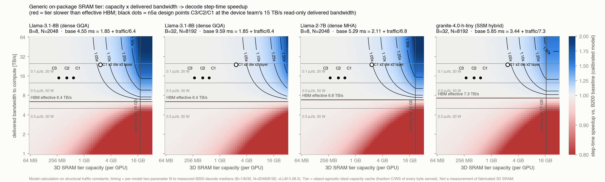

> **이 문서는 작업 로그다 (2026-09-20).** 현재 기준 문서는 [SRAM_HIERARCHY_MODEL.md](SRAM_HIERARCHY_MODEL.md)이며, 거기서 단일 "fabric 20 TB/s" 가정을 HBM→L2 / L2→SM / 3D→SM 세 링크로 분리하고 추상화 사다리(M0~M5)로 다시 세웠다. 수치가 다르면 그쪽이 우선한다. 특히 이 문서 10-3절의 "범용 LRU 1.000"은 충전 트래픽을 계상하면 0.50이 되고, 결론(캐시는 성립하지 않는다)은 더 강해진다.

# 3D SRAM Capacity × Bandwidth Sweep: 범용 티어가 언제 이득이 되는가

작성 2026-09-20. 2026-09-19 교수님 미팅에서 정한 첫 실험("L2/SRAM capacity × bandwidth sweep, 병목이 HBM에서 SRAM으로 옮겨오는 경계선")의 결과다. 다음 미팅 자료. 재현: `python3 scripts/sram_capacity_bandwidth_sweep.py` → `assets/sweep/*.csv`, `python3 scripts/make_sram_sweep_figure.py` → `assets/figures/sram-capacity-bandwidth-map.{svg,pdf,png}`.

## 0. 질문

1. 기존 GPU(L2 → HBM)에 범용 SRAM 티어를 더하면 무엇이 좋아지는가. 정책 없이, 가장 평범한 캐시 사용법으로.
2. 그 이득을 얻으려면 티어가 어느 용량과 어느 전달 대역폭을 가져야 하는가. 대역폭을 어디까지 낮춰도 이득이 남는가. 언제 티어 자체가 병목이 되는가.
3. 그 요구조건을 소자 쪽 설계점(C1/C2/C3, 열 상한)과 겹치면 무엇이 남는가.

## 1. 한 줄 답

**대역폭은 문턱값이고 용량이 크기를 정한다.** 티어의 전달 대역폭이 HBM 유효 대역폭(모델별 6.4~7.3 TB/s, 피크 8)보다 낮으면 어떤 용량에서도 손해다. 그 위에서는 이득이 거의 전적으로 용량/working set 비로 정해지고, 대역폭을 8에서 60 TB/s로 올려도 1 GB 이하에서는 1%p 안에서 움직인다. dense decode에서 1.05×에는 GPU당 약 2.5 GB(15 TB/s) 또는 1.7 GB(60 TB/s), 1.10×에는 약 5 GB / 3 GB, 1.25×에는 약 10 GB / 7 GB가 필요하다. 단일 다이 320 mm²(= 800 mm² 다이의 커버리지 0.4)의 278~590 MB는 1.004~1.011×다. **커버리지를 1.0으로 올린 GB급 재실행은 10절에 있다.** 속도 상한은 트래픽과 무관한 고정 시간 t0(1.9~3.4 ms)가 정하며, working set 전부를 무한 대역폭 티어에 넣어도 dense 2.5×, hybrid 1.7~1.9×다.

## 2. 방법

**티어 의미(정책 없음).** G1 = object-agnostic 이상 용량 캐시: 스텝 트래픽의 모든 바이트 중 f = min(1, C/WS) 비율을 티어가 서비스한다(어떤 교체 정책의 상한). G2 = 순환 접근 LRU: C ≥ WS가 아니면 적중 0(하한). G3 = 객체 인식 ledger + 입장 판정(enhancement, 본문에서는 쓰지 않음). WS = weight 상주 + KV + state, T = 스텝 트래픽(weight 읽기 + KV 읽기·쓰기 + state 읽기·쓰기), 구조식 상수는 `scenario-lab.html`과 같다.

**타이밍 모델(보정).** step = t0 + (T − served)/BW_eff + served/BW_tier. t0와 BW_eff는 모델별로 실측 B200 decode 중앙값(B = 1/8/32 × N = 2,048, B = 8 × N = 8,192, vLLM 0.28.0) 3~4점에 최소제곱으로 맞췄다. 기존 lab의 겹침 경계는 compute floor를 "실측 − 트래픽/8 TB/s"의 잔차로 정의해 B = 8에서 티어 효과를 전부 지우는 문제가 있어 본문에서는 쓰지 않는다(직렬 합·겹침 두 경계는 CSV에 함께 있다).

| 모델 | t0 [ms] | BW_eff [TB/s] | 앵커 수 | 최대 오차 | 판정 |
|---|---:|---:|---:|---:|---|
| Llama-3.1-8B | 1.85 | 6.40 | 4 | 2.1% | 사용 |
| Qwen3-8B | 2.20 | 6.43 | 4 | 1.0% | 사용 |
| Mistral-7B | 2.09 | 6.56 | 4 | 2.3% | 사용 |
| Llama-2-7B | 2.11 | 6.84 | 4 | 0.7% | 사용 |
| granite-4.0-h-tiny | 3.44 | 7.28 | 4 | 1.8% | 사용 |
| Gemma-3-27B | 0.00 | 4.47 | 4 | 4.2% | 제외: t0 음수, 트래픽 모델 재검토 |
| gpt-oss-120b | 6.36 | 38.49 | 3 | 1.3% | 제외: 트래픽에 무반응(HBM-bound 아님) |
| DeepSeek-V2-Lite | 3.48 | 20.15 | 4 | 6.1% | 제외: 트래픽에 무반응(HBM-bound 아님) |

dense 4종과 Granite는 2% 안에서 맞는다. gpt-oss-120b와 DeepSeek-V2-Lite는 실측 step 시간이 트래픽에 거의 반응하지 않아(유효 대역폭 추정 20~38 TB/s) 이 배치 조건에서는 HBM-bound가 아니다. 티어가 도울 수 있는 대상이 아니므로 요구조건 계산에서 제외하고, MoE 트래픽 모델(균등 라우팅 union) 자체의 검증 과제로 남긴다. Gemma-3-27B는 t0가 음수로 나와 트래픽 모델 재검토 대상이다.

## 3. 결과: 용량 × 대역폭 → step 속도 향상 (G1, 보정 모델)

**Llama-3.1-8B B=8 N=2,048** — WS 18.2 GB, 트래픽 17.2 GB/step, 기준 4.55 ms, 상한(C = WS, BW = ∞) 2.46×

| C \ BW | 5 TB/s | 8 TB/s | 15 TB/s | 24 TB/s | 60 TB/s |
|---:|---:|---:|---:|---:|---:|
| 278 MB | 0.997† | 1.002 | 1.005 | 1.007 | 1.008 |
| 422 MB | 0.996† | 1.003 | 1.008 | 1.010 | 1.012 |
| 590 MB | 0.995† | 1.004 | 1.011 | 1.014 | 1.017 |
| 1,180 MB | 0.989† | 1.008 | 1.022 | 1.029 | 1.035 |
| 2,360 MB | 0.979† | 1.016 | 1.046 | 1.060 | 1.074 |
| 4,096 MB | 0.964† | 1.027 | 1.083 | 1.108 | 1.135 |
| 8,192 MB | 0.931† | 1.056 | 1.180 | 1.243 | 1.312 |
| 16,384 MB | 0.871† | 1.120 | 1.440 | 1.641 | 1.907 |

**Llama-3.1-8B B=32 N=8,192** — WS 50.5 GB, 트래픽 49.5 GB/step, 기준 9.59 ms, 상한(C = WS, BW = ∞) 5.18×

| C \ BW | 5 TB/s | 8 TB/s | 15 TB/s | 24 TB/s | 60 TB/s |
|---:|---:|---:|---:|---:|---:|
| 278 MB | 0.999† | 1.001 | 1.003 | 1.003 | 1.004 |
| 422 MB | 0.998† | 1.001 | 1.004 | 1.005 | 1.006 |
| 590 MB | 0.997† | 1.002 | 1.005 | 1.007 | 1.008 |
| 1,180 MB | 0.995† | 1.004 | 1.011 | 1.014 | 1.017 |
| 2,360 MB | 0.990† | 1.008 | 1.022 | 1.028 | 1.035 |
| 4,096 MB | 0.982† | 1.013 | 1.039 | 1.050 | 1.062 |
| 8,192 MB | 0.965† | 1.027 | 1.081 | 1.106 | 1.133 |
| 16,384 MB | 0.932† | 1.055 | 1.177 | 1.238 | 1.306 |

**Llama-2-7B B=8 N=2,048** — WS 22.1 GB, 트래픽 21.8 GB/step, 기준 5.29 ms, 상한(C = WS, BW = ∞) 2.51×

| C \ BW | 5 TB/s | 8 TB/s | 15 TB/s | 24 TB/s | 60 TB/s |
|---:|---:|---:|---:|---:|---:|
| 278 MB | 0.997† | 1.001 | 1.004 | 1.005 | 1.007 |
| 422 MB | 0.996† | 1.002 | 1.006 | 1.008 | 1.010 |
| 590 MB | 0.994† | 1.002 | 1.009 | 1.012 | 1.014 |
| 1,180 MB | 0.988† | 1.005 | 1.018 | 1.024 | 1.029 |
| 2,360 MB | 0.977† | 1.009 | 1.036 | 1.048 | 1.060 |
| 4,096 MB | 0.961† | 1.016 | 1.065 | 1.087 | 1.110 |
| 8,192 MB | 0.924† | 1.033 | 1.138 | 1.190 | 1.247 |
| 16,384 MB | 0.859† | 1.069 | 1.321 | 1.469 | 1.655 |

**Granite 4.0-h-tiny B=32 N=8,192** — WS 17.1 GB, 트래픽 17.5 GB/step, 기준 5.85 ms, 상한(C = WS, BW = ∞) 1.70×

| C \ BW | 5 TB/s | 8 TB/s | 15 TB/s | 24 TB/s | 60 TB/s |
|---:|---:|---:|---:|---:|---:|
| 278 MB | 0.997† | 1.001 | 1.003 | 1.005 | 1.006 |
| 422 MB | 0.995† | 1.001 | 1.005 | 1.007 | 1.009 |
| 590 MB | 0.994† | 1.001 | 1.007 | 1.010 | 1.013 |
| 1,180 MB | 0.987† | 1.003 | 1.015 | 1.020 | 1.026 |
| 2,360 MB | 0.975† | 1.005 | 1.030 | 1.041 | 1.053 |
| 4,096 MB | 0.957† | 1.009 | 1.053 | 1.074 | 1.095 |
| 8,192 MB | 0.918† | 1.018 | 1.113 | 1.159 | 1.210 |
| 16,384 MB | 0.848† | 1.037 | 1.255 | 1.379 | 1.530 |

**Granite 4.0-h-tiny B=64 N=8,192** — WS 20.2 GB, 트래픽 22.0 GB/step, 기준 6.47 ms, 상한(C = WS, BW = ∞) 1.88×

| C \ BW | 5 TB/s | 8 TB/s | 15 TB/s | 24 TB/s | 60 TB/s |
|---:|---:|---:|---:|---:|---:|
| 278 MB | 0.997† | 1.001 | 1.003 | 1.005 | 1.006 |
| 422 MB | 0.996† | 1.001 | 1.005 | 1.007 | 1.009 |
| 590 MB | 0.994† | 1.001 | 1.007 | 1.010 | 1.012 |
| 1,180 MB | 0.988† | 1.002 | 1.014 | 1.019 | 1.025 |
| 2,360 MB | 0.976† | 1.005 | 1.029 | 1.040 | 1.051 |
| 4,096 MB | 0.959† | 1.009 | 1.051 | 1.071 | 1.091 |
| 8,192 MB | 0.920† | 1.017 | 1.108 | 1.153 | 1.200 |
| 16,384 MB | 0.853† | 1.036 | 1.243 | 1.360 | 1.501 |

† = 티어가 HBM 유효 대역폭보다 느려 손해.

**목표 속도에 필요한 용량 (GPU당, G1).**

| workload | 1.05× @15 TB/s | 1.05× @60 | 1.10× @15 | 1.10× @60 | 1.25× @15 | 1.25× @60 |
|---|---:|---:|---:|---:|---:|---:|
| Llama-3.1-8B B=8 N=2,048 | 2.6 GB | 1.6 GB | 4.9 GB | 3.1 GB | 10.7 GB | 6.9 GB |
| Llama-3.1-8B B=32 N=8,192 | 5.2 GB | 3.3 GB | 9.9 GB | 6.4 GB | 21.8 GB | 14.0 GB |
| Llama-2-7B B=8 N=2,048 | 3.2 GB | 2.0 GB | 6.1 GB | 3.8 GB | 13.5 GB | 8.3 GB |
| Granite 4.0-h-tiny B=32 N=8,192 | 3.8 GB | 2.3 GB | 7.3 GB | 4.3 GB | 16.1 GB | 9.5 GB |
| Granite 4.0-h-tiny B=64 N=8,192 | 4.0 GB | 2.3 GB | 7.6 GB | 4.5 GB | 16.8 GB | 9.8 GB |

## 4. 병목이 옮겨오는 경계

- **문턱(모든 용량 공통):** BW_tier < BW_eff(HBM)이면 served 바이트마다 시간이 늘어 손해다. 그림의 빨간 영역이며 용량과 무관하다. 필요조건은 **BW_tier ≥ HBM 유효 대역폭(6.4~7.3 TB/s, 피크 8)**이다.
- **포화:** 문턱 위에서 이득 = served × (1/BW_eff − 1/BW_tier). C ≤ 1 GB에서는 served가 작아 BW를 8→60으로 올려도 1%p 안이다. 용량이 WS에 가까워질수록 BW 민감도가 커진다(Llama B=8, 16 GB: 8 TB/s 1.12× → 60 TB/s 1.91×).
- **SRAM이 병목이 되는 경우:** 겹침 경계에서 티어 시간이 HBM 시간을 넘는 조건은 BW_tier < f·T / max(compute, (1 − f)·T/8)이다. 590 MB(f ≈ 3%)에서는 0.2 TB/s 아래, WS 전체(f = 1)에서는 5~11 TB/s다. 즉 우리가 논의한 용량 범위에서 "SRAM 자체가 병목"이 되는 일은 대역폭이 HBM보다 낮을 때만 생긴다.

**교수님 가설 검증.** "640 MB에서 1%밖에 안 좋아진 것은 SRAM 대역폭을 너무 낮게 줘서 병목이 SRAM으로 옮겨간 탓"은 이 모델에서는 성립하지 않는다. lab 기본값 20 TB/s는 HBM 피크의 2.5배였고, 590 MB에서 BW를 8→60 TB/s로 올려도 Llama B=8은 1.004→1.017×다. 1%의 원인은 용량/WS 비(3%)다. 단, 대역폭이 실제로 병목이 되는 두 경우는 따로 확인됐다. (1) 기존 L2를 잘라 쓰는 partition 대리실험(일반 L2 축소 비용), (2) 쓰기 비중이 큰 state를 올릴 때 소자팀 BW(r) 모델의 전달 대역폭이 3.8 TB/s 이하로 떨어져 HBM보다 느려지는 경우.

## 5. 물리 설계점을 지도 위에 올리면

| 설계점 | 용량 | 전달 BW 가정 | Llama-3.1-8B B=8 | Llama-3.1-8B B=32 N=8k | Llama-2-7B B=8 | Granite B=32 N=8k | 로직 다이 비용 |
|---|---:|---:|---:|---:|---:|---:|---|
| C3 1층 1다이 | 278 MB | 15.0 TB/s | 1.005× | 1.003× | 1.004× | 1.003× | 0 |
| C2 1층 1다이 | 422 MB | 15.0 TB/s | 1.008× | 1.004× | 1.006× | 1.005× | 0 |
| C1 1층 1다이 | 590 MB | 15.0 TB/s | 1.011× | 1.005× | 1.009× | 1.007× | 하부 Si 128 mm² (16%) |
| C1 1층 2다이 | 1,180 MB | 15.0 TB/s | 1.022× | 1.011× | 1.018× | 1.015× | 256 mm² |
| C1 2층 2다이 (열 계수 0.6) | 2,360 MB | 24.0 TB/s | 1.060× | 1.028× | 1.048× | 1.041× | 256 mm² + 열 |
| C3 2층 2다이 (열 계수 0.6) | 1,112 MB | 24.0 TB/s | 1.027× | 1.013× | 1.022× | 1.019× | 0 + 열 |

소자팀 열 상한(P/E)과 겹치면: 0.5 pJ/bit·20 W = 5 TB/s는 HBM 유효 대역폭 아래라 **어떤 용량에서도 무효**다. 0.5 pJ·50 W 또는 0.1 pJ·10 W(12.5 TB/s)면 문턱은 넘지만 포화 구간(15~25)에는 못 미친다. 0.1 pJ·20 W(25 TB/s)면 충분하다. 따라서 티어가 의미를 갖는 기술 조건은 **E/bit ≤ 0.1 pJ 또는 티어 전력 예산 ≥ 50 W**, 그리고 **GPU당 GB급 용량**이다.

## 6. 소자 쪽으로 내려보내는 spec target (초안)

| 항목 | 요구 | 근거 |
|---|---|---|
| 전달 대역폭 하한 | ≥ 8 TB/s (HBM 피크), 실질 ≥ 6.4~7.3 | 그 아래는 모든 용량에서 손해 |
| 전달 대역폭 권장 | 15~25 TB/s | 1 GB 이하에서는 8 이상이면 포화, GB급에서 15→60 차이가 커짐 |
| 용량 (dense decode, B = 8~32) | 1.05×: ≥ 2.5 GB, 1.10×: ≥ 5 GB, 1.25×: ≥ 10 GB (15 TB/s 기준) | 3절 표 |
| 열·전력 | E/bit ≤ 0.1 pJ 또는 예산 ≥ 50 W | P/E 상한이 문턱 8 TB/s를 넘어야 함 |
| 쓰기 처리 | η_bank(r = 0.5) ≥ 0.7 | state·KV 쓰기가 섞여도 전달 BW가 HBM 아래로 떨어지지 않도록 |
| 단일 다이 320 mm² 1층 | 278~590 MB → 1.004~1.011× | 기술 데모는 되지만 시스템 이득 주장은 불가 |

## 7. 이 결과의 경계

- 모델 계산이다. t0·BW_eff만 실측에서 왔고, 티어의 서비스 시간은 served/BW_tier라는 단순 모델이다. 지연·큐잉·뱅크 충돌은 소자팀 BW(r) 모델로 별도 보정한다.
- G1은 어떤 교체 정책의 상한이다. 실제 LRU는 순환 접근에서 C < WS일 때 적중이 거의 없다(G2). B200 대리실험에서 default(힌트 없음) 대비 persisting 힌트가 1.05~1.11×였던 것이 그 격차의 실측 예다. 즉 "범용 캐시"의 실제 이득은 G1보다 작고, G1에 가까워지려면 보호·고정 배치가 필요하다. 이것이 정책이 들어오는 자리이며 마지막 절의 enhancement로 다룬다.
- 앵커는 B ≤ 32다. B = 64 이상은 외삽이다.
- MoE 두 모델과 Gemma는 트래픽 모델이 실측과 맞지 않아 제외했다. 이 자체가 "MoE 소배치 decode는 HBM-bound가 아니다"라는 보고 사항이다.
- prefill은 다루지 않았다.

## 10. 면적을 축으로 올린 재실행 — GB급에서 무엇이 달라지는가 (2026-09-20 추가)

앞 절들은 티어를 320 mm²/다이로 고정했다. 그 320은 덱의 다이 800 mm² × 커버리지 0.4이며, 커버리지를 고정값처럼 쓴 것이 잘못이었다. 면적을 축으로 올려 다시 돌렸다. 재현: `python3 scripts/sram_area_scaling.py` → `assets/sweep/sram_area_scaling.csv`.

용량 = 밀도[구성] × 다이 면적 × 커버리지 × 층수 × 다이 수. 밀도는 소자팀 2026-09-20 회신의 사용가능 밀도(C3 0.869, C2 1.319, C1 1.844 MB/mm²)이고 다이 수는 B200급 2다이다.

### 10-1. 용량 사다리와 C1의 자기모순

| 구성 | 용량 | 하부 Si 청구 | 로직 다이 중 | 실현 |
|---|---:|---:|---:|---|
| C3 800 mm² 1층 | 1.39 GB | 0 | 0% | 가능 |
| C3 800 mm² 2층 | 2.78 GB | 0 | 0% | 가능 |
| C2 800 mm² 1층 | 2.11 GB | 0 | 0% | 가능 |
| C2 800 mm² 2층 | 4.22 GB | 0 | 0% | 가능 |
| C1 800 mm² 1층 | 2.95 GB | 640 mm² | 40% | 조건부 |
| C1 800 mm² 2층 | 5.90 GB | 1,280 mm² | 80% | **불가** |

C1의 "하부 Si 128 mm²"는 티어 320 mm²당 값이다. 티어를 다이 전체로 키우면 Si 청구도 같은 배율로 커진다. 2층 C1의 5.90 GB는 로직 다이의 80%를 페리가 가져가므로 존재할 수 없다. 1층 C1도 40%를 청구한다. 그 잃은 compute를 고정 항 t0에 반영하면(t0 → t0/(1−0.40), 가정) speedup이 1.058에서 **0.822로 역전**된다. 결국 **GB급에서 쓸 수 있는 구성은 Si를 쓰지 않는 C3·C2뿐**이고, 최대 실현 용량은 C2 2층 4.22 GB다.

### 10-2. 용량을 GB급으로 올린 결과 (BW 15 TB/s, 이상 캐시 G1)

| workload | WS | 1.39 GB | 2.11 GB | 2.78 GB | 4.22 GB | 5.90 GB |
|---|---:|---:|---:|---:|---:|---:|
| Llama-3.1-8B B=8 N=2k | 18.2 GB | 1.027 | 1.041 | 1.055 | 1.085 | 1.124 |
| Llama-3.1-8B B=32 N=8k | 50.5 GB | 1.013 | 1.020 | 1.026 | 1.040 | 1.057 |
| Llama-2-7B B=8 N=2k | 22.1 GB | 1.021 | 1.032 | 1.043 | 1.067 | 1.096 |
| Qwen3-8B B=8 N=2k | 18.8 GB | 1.023 | 1.036 | 1.047 | 1.074 | 1.106 |
| Granite B=32 N=8k | 17.1 GB | 1.018 | 1.027 | 1.036 | 1.055 | 1.079 |

590 MB에서 1.004였던 것이 GB급에서 1.03~1.12가 된다. **면적 가정을 고친 것은 옳았고, 효과는 10~30배 커진다.** 다만 실현 상한인 C2 2층 4.22 GB에서 8.5%이고, 10%를 넘으려면 5 GB 이상 또는 더 높은 대역폭이 필요하다.

### 10-3. 결정적 결과 — 정책 없는 범용 캐시는 GB급에서도 1.000이다

| 용량 | G1 이상 캐시 | G2 실제 LRU | G3 ledger | G1 커버리지 |
|---:|---:|---:|---:|---:|
| 1.39 GB | 1.027 | **1.000** | 1.028 | 7.6% |
| 2.78 GB | 1.055 | **1.000** | 1.057 | 15.2% |
| 4.22 GB | 1.085 | **1.000** | 1.088 | 23.1% |
| 5.90 GB | 1.124 | **1.000** | 1.126 | 32.3% |

이유는 접근 패턴이다. decode는 스텝마다 working set 전체를 한 번씩 훑으므로 모든 바이트의 재사용 거리가 working set 크기와 같다. LRU는 용량이 working set보다 작으면 되돌아왔을 때 항상 밀려나 있어 적중이 0이다. 용량을 5배 키워도 0이다. 18 GB working set을 다 담으려면 티어가 18 GB여야 하는데 그것은 C2 2층의 4배다.

따라서 10-2의 1.03~1.12는 **범용 캐시의 값이 아니라 이상적 고정 배치(G1)의 값**이다. 그 값을 실현하려면 어떤 바이트를 붙잡아 둘지 정하는 장치, 즉 고정·보호·입장 판정이 필요하다. B200 대리실험이 같은 것을 실측으로 보여 준다. 힌트 없는 기본 캐시가 1.000일 때 persisting 힌트가 1.05~1.11이었다.

**이것이 "정책이 실험 결과에서 요구되어 들어온다"는 구조 그 자체다.** 먼저 범용 캐시로 재 보고, 0이 나오고, 왜 0인지 설명하고, 그래서 배치가 필요하다는 순서가 성립한다. 논문 A는 정책을 마지막에 두되 이 0을 근거로 둔다.

### 10-4. GB급에서는 대역폭이 다시 살아난다

| 용량 | 8 TB/s | 15 | 30 | 60 | 8→60 폭 |
|---:|---:|---:|---:|---:|---:|
| 0.56 GB | 1.004 | 1.010 | 1.014 | 1.016 | +1.3%p |
| 1.39 GB | 1.009 | 1.027 | 1.037 | 1.042 | +3.3%p |
| 2.95 GB | 1.020 | 1.058 | 1.082 | 1.094 | +7.4%p |
| 5.90 GB | 1.040 | 1.124 | 1.178 | 1.207 | +16.7%p |

590 MB에서 대역폭은 1.3%p짜리 변수였다. 5.9 GB에서는 16.7%p다. **교수님 가설은 590 MB에서는 틀렸지만 GB급에서는 맞다.** 용량과 대역폭은 곱해져서 이득이 되므로, 용량을 키운 뒤에야 대역폭이 의미를 갖는다. 이 순서 자체가 논문의 그림 하나가 된다.

### 10-5. 전력 해석 수정 — duty cycle

| 용량 | BW | duty | 0.1 pJ 평균/순간 | 0.5 pJ 평균/순간 |
|---:|---:|---:|---:|---:|
| 1.39 GB | 15 TB/s | 2.0% | 0.2 W / 12 W | 1.2 W / 60 W |
| 2.95 GB | 15 TB/s | 4.3% | 0.5 W / 12 W | 2.6 W / 60 W |
| 5.90 GB | 15 TB/s | 9.2% | 1.1 W / 12 W | 5.5 W / 60 W |

티어는 스텝 내내 스트리밍하지 않는다. 5.9 GB에서도 4.05 ms 스텝 중 0.37 ms만 쓴다. 열은 평균 전력이 정하므로 평균은 한 자리 W다. 소자팀의 BW ≤ P/E는 순간 관계이며, 예산 P가 지속 전력인지 순간 전력인지에 따라 5절의 결론(0.5 pJ·20 W면 무효)이 달라진다. **확인 항목으로 소자팀에 추가한다.**

### 10-6. 이 절이 바꾼 것

- 5·6절의 "단일 다이 278~590 MB는 1.004~1.011배"는 커버리지 0.4 가정의 결과다. 커버리지 1.0에서는 C3 1.39 GB·1.027배, C2 2.11 GB·1.041배다.
- 6절 spec target의 용량 항을 고친다. 1.05배에 2.5 GB가 필요하다는 것은 유효하고, **C2 1층 2.11 GB와 C3 2층 2.78 GB가 그 문턱 양옆**이다. 1.10배의 5 GB는 실현 상한 4.22 GB를 넘으므로 층수나 밀도 개선이 필요하다.
- C1은 GB급에서 선택지가 아니다. 2층은 불가, 1층은 compute 손실을 물리면 손해다. **논문의 물리 설계점은 C3와 C2로 좁힌다.**
- 티어 의미를 G1으로 쓸 때는 반드시 "고정 배치가 있어야 도달 가능한 상한"이라고 라벨한다. 범용 LRU는 0이다.

## 9. 평가 설계에 대한 함의 (인접 논문 조사 반영)

[PRIOR_WORK_EVAL.md](PRIOR_WORK_EVAL.md)에서 인접 논문 14편의 평가 방법을 뜯은 결과, 논문 A가 맞춰야 할 것과 이미 앞선 것이 갈렸다.

**이미 앞선 것.** GPU 베이스라인을 실제로 측정한 논문은 조사 대상 중 둘뿐이다(CENT의 vLLM 4×A100, NeuPIMs의 PyTorch A100). 나머지는 GPU를 피크 스펙에서 모델링한다. 우리는 B200에서 vLLM 0.28.0으로 직접 쟀다. 또 fast tier의 지연을 적지 않는 것이 정책 논문 4편 모두의 관행인데, 우리는 소자팀에서 용량·대역폭·열 상한을 앵커로 받는다.

**채워야 할 것.** 70B급 모델이 없다(조사 대상은 65B~175B가 표준). 배치가 32에서 멈춘다(표준은 32~128, 최대 512). 공개 trace가 없다(ShareGPT가 6편 중 3편, Azure trace가 2편). HBM과 티어의 pJ/bit 출처가 없다(하드웨어 논문은 0.66~0.88 pJ/bit를 인용한다). 사이클 수준 메모리 모델이 없다(Ramulator 계열이 6편 중 4편).

**그래도 방어되는 선택.** G1(이상 용량 캐시)은 상한 모델이지만, Dynamic KV Placement의 헤드라인 5.87×도 접근을 미리 아는 oracle이고 논문이 그것을 명시한다. 상한을 상한이라고 부르면 이 커뮤니티에서 통용된다. 다만 AVMP가 이득을 가상 계층과 재배치로 분해했듯, 우리도 마지막 절에서 범용 캐시와 객체 인식 배치를 분해해야 한다.

**공백.** 3D 적층 논문 중 용량 × 대역폭을 축으로 sweep한 것은 LaMoSys3.5D 하나뿐이고, 그것도 chiplet 단위 Pareto다. 열을 실제 도구로 넣은 것은 Tasa와 LaMoSys 둘이다. 이 문서의 지도와 열 상한 오버레이는 그 공백을 겨눈다.

## 8. 다음 미팅에 가져갈 것과 그 다음

1. 이 문서의 그림 하나와 3·5·6절 표.
2. 소자팀에 6절 target 초안 전달, η_bank(0.5)·E/bit·패브릭 회신 요청.
3. 실측 보강 우선순위(9절 기준): (a) 70B급 모델 1종과 배치 64/128 decode 앵커, (b) ShareGPT 기반 가변 길이 실행, (c) HBM·티어 pJ/bit 출처 확보, (d) B200 persisting-L2를 "범용 캐시 vs 고정 배치" 대리실험으로 재해석한 그림. (a)~(b)는 GPU 재확보가 필요하다.
4. 논문 A 구조: Fig.1 왜 용량인가(B200 실측 트래픽) → Fig.2 용량만 → Fig.3 용량 × 대역폭(이 문서) → Fig.4 물리 설계점 → Fig.5 실제 제약(read/fill·패브릭·열) → Fig.6 workload 일반성 → Fig.7 (선택) 범용 캐시 vs 단순 객체 인식 배치.
